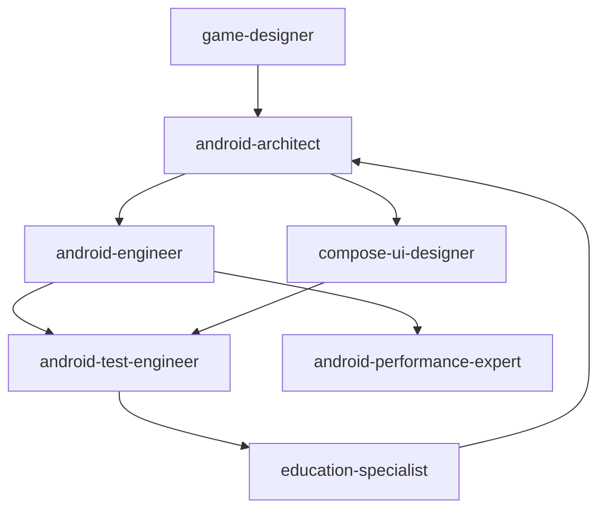

# Wordland 项目状态报告与行动计划

**报告日期**: 2026-02-15
**项目状态**: 🟢 健康运行中
**编译状态**: ✅ BUILD SUCCESSFUL

---

## 一、项目概况

### 1.1 基本信息

- **项目名称**: Wordland (KET/PET 词汇学习游戏)
- **技术栈**: Kotlin + Jetpack Compose + Hilt + Room
- **架构模式**: Clean Architecture (干净架构)
- **Min SDK**: 26, **Target SDK**: 34
- **总代码文件**: 79 个 Kotlin 文件

### 1.2 当前架构

```
┌─────────────────────────────────────┐
│       UI Layer (30 文件)            │
│  - Screens (7 个)                   │
│  - ViewModels (6 个)                │
│  - Components (10 个)               │
│  - UiState (7 个)                   │
└─────────────────────────────────────┘
                ↓ calls
┌─────────────────────────────────────┐
│    Domain Layer (20 文件)           │
│  - UseCases (8 个) ✅               │
│  - Models (9 个)                    │
│  - Algorithms (2 个) ✅             │
│  - Constants (1 个) ✅              │
└─────────────────────────────────────┘
                ↓ calls
┌─────────────────────────────────────┐
│     Data Layer (24 文件)            │
│  - Repositories (6 个)              │
│  - DAOs (6 个)                      │
│  - Entities (6 个)                  │
│  - Seeders (3 个)                   │
└─────────────────────────────────────┘
```

---

## 二、已完成工作总结

### 2.1 架构重构 ✅

**状态**: 100% 完成

**成果**:
- ✅ Clean Architecture 分层实现
- ✅ 算法迁移到 Domain Layer (`GuessingDetector`, `MemoryStrengthAlgorithm`)
- ✅ 常量按层级分离 (`DomainConstants` vs `AppConstants`)
- ✅ UseCase 层完整实现 (8 个 UseCases)
- ✅ 4 个 ViewModel 重构使用 UseCases
- ✅ 零依赖违反（Domain 层不依赖 Core/Data）

**修复问题**:
- ✅ 78 个编译错误全部修复
- ✅ UI/Compose 问题全部解决
- ✅ 测试基础设施搭建完成

### 2.2 UseCase 层实现 ✅

**已实现的 8 个 UseCases**:

1. **LoadLevelWordsUseCase** - 加载关卡单词
2. **SubmitAnswerUseCase** - 提交答案（核心业务逻辑）
3. **GetNextWordUseCase** - 获取下一个单词
4. **GetIslandsUseCase** - 获取岛屿列表
5. **GetLevelsUseCase** - 获取关卡列表
6. **GetReviewWordsUseCase** - 获取复习单词
7. **GetUserStatsUseCase** - 获取用户统计
8. **UseHintUseCase** - 使用提示

### 2.3 测试基础设施 ✅

**成果**:
- ✅ 测试目录结构完整
- ✅ 5 个测试文件，35 个测试用例
- ✅ 测试运行脚本 (`run-tests.sh`)
- ✅ 测试文档 (`TEST_DOCUMENTATION.md`, `TEST_SUMMARY.md`)

**测试分布**:
- UseCase 测试: 3 个文件，16 个测试
- Algorithm 测试: 1 个文件，12 个测试
- ViewModel 测试: 1 个文件，7 个测试（需要修复编译错误）

### 2.4 ViewModel 重构状态

| ViewModel | UseCases | 状态 |
|-----------|----------|------|
| HomeViewModel | GetUserStatsUseCase, GetIslandsUseCase | ✅ 完成 |
| IslandMapViewModel | GetIslandsUseCase | ✅ 完成 |
| LearningViewModel | LoadLevelWordsUseCase, SubmitAnswerUseCase, UseHintUseCase | ✅ 完成 |
| LevelSelectViewModel | GetLevelsUseCase | ✅ 完成 |
| ProgressViewModel | - | ⚠️ 未重构 |
| ReviewViewModel | - | ⚠️ 未重构 |

**完成度**: 4/6 (67%)

---

## 三、项目角色体系

### 3.1 已定义的角色

根据 `/wordland/adapter` 定义，项目有 7 个专业角色：

#### 1. **android-architect** (架构师)
- **职责**: 架构设计、技术选型、代码质量保障
- **输出**: 架构设计文档、接口定义、技术规范
- **输入**: 游戏需求、UI设计、测试需求、性能目标

#### 2. **android-engineer** (工程师)
- **职责**: UseCase/ViewModel/Repository 实现、业务逻辑编写
- **输出**: 功能代码、单元测试
- **输入**: 架构设计、接口规范、UI需求

#### 3. **android-test-engineer** (测试工程师)
- **职责**: 测试策略设计、测试用例编写、测试自动化
- **输出**: 测试代码、覆盖率报告、CI配置
- **输入**: 架构规范、功能需求、覆盖率要求

#### 4. **android-performance-expert** (性能专家)
- **职责**: 性能优化、内存优化、流畅度提升
- **输出**: 优化方案、性能报告
- **输入**: 性能问题、性能目标

#### 5. **compose-ui-designer** (UI设计师)
- **职责**: Compose UI设计、交互设计、动画效果
- **输出**: UI组件、交互原型、设计规范
- **输入**: 游戏需求、用户体验目标

#### 6. **game-designer** (游戏设计师)
- **职责**: 游戏机制设计、关卡设计、奖励系统
- **输出**: 游戏设计文档、关卡配置
- **输入**: 教学需求、学习目标

#### 7. **education-specialist** (教育专家)
- **职责**: 教学方法设计、记忆曲线优化、学习路径
- **输出**: 教学方案、记忆算法参数
- **输入**: 学习目标、用户反馈

---

## 四、工作流框架

### 4.1 plan-execute-review 工作流

项目采用 **计划-执行-评审** 工作流：

```
┌─────────────┐      ┌──────────┐      ┌──────────┐
│ Elicitate  │ ──>  │  Plan    │ ──>  │ Execute  │
│ (需求收集) │      │ (架构设计)│      │ (代码实现)│
└─────────────┘      └──────────┘      └──────────┘
                                               │
                                               v
                                         ┌──────────┐
                                         │  Review  │
                                         │ (评审反馈)│
                                         └──────────┘
```

### 4.2 反馈循环

1. **Executor → Plan**: 执行发现问题 → 调整计划
2. **Review → Plan**: 评审发现缺陷 → 修正计划
3. **Review → Executor**: 评审发现问题 → 重新执行

---

## 五、当前问题识别

### 5.1 高优先级问题 (P0)

#### 🔴 **问题1: ProgressViewModel 和 ReviewViewModel 未使用 UseCases**

**影响**: 违反 Clean Architecture，ViewModel 包含业务逻辑

**现状**:
```kotlin
// ProgressViewModel 直接访问 Repository
// ReviewViewModel 直接访问 Repository
```

**解决方案**: 需要 **android-engineer** 重构这两个 ViewModel

**所需 UseCases**:
- `GetUserProgressUseCase` - 获取用户总体进度
- `GetDetailedStatsUseCase` - 获取详细统计数据

---

#### 🔴 **问题2: 测试覆盖不足**

**现状**:
- 测试文件数: 6 个
- 总测试用例: 35 个
- 覆盖率: 未知（需要测量）
- Android UI 测试: 0 个

**目标**:
- 单元测试覆盖率 > 80%
- 关键路径覆盖率 100%

**负责角色**: **android-test-engineer**

---

### 5.2 中优先级问题 (P1)

#### 🟡 **问题3: 缺少 UI 组件测试**

**现状**:
- 10 个 UI Components 没有测试
- Compose UI 测试框架已配置但未使用

**影响**: UI 交互质量无法保证

**负责角色**: **android-test-engineer**

---

#### 🟡 **问题4: 缺少集成测试**

**现状**:
- Repository + DAO 集成测试: 0 个
- 端到端测试: 0 个

**影响**: 数据层集成问题无法早期发现

**负责角色**: **android-test-engineer**

---

#### 🟡 **问题5: 性能优化未进行**

**现状**:
- 无性能基准测试
- 无内存泄漏检测
- 无流畅度优化

**建议**: 需要性能分析和优化

**负责角色**: **android-performance-expert**

---

### 5.3 低优先级问题 (P2)

#### 🔵 **问题6: UI/UX 优化**

**现状**:
- 基础 UI 已实现
- 动画效果已添加
- 但用户体验可进一步优化

**建议**: 游戏化反馈、微交互优化

**负责角色**: **compose-ui-designer**, **game-designer**

---

#### 🔵 **问题7: 教学算法优化**

**现状**:
- 基础记忆算法已实现
- 但教学效果未经验证

**建议**: 根据实际使用数据优化算法参数

**负责角色**: **education-specialist**

---

## 六、下一步行动计划

### 🎯 立即行动（本周）

#### Action 1: 完成 ViewModel 重构
**负责角色**: **android-engineer**

**任务**:
1. 创建 `GetUserProgressUseCase`
2. 创建 `GetDetailedStatsUseCase`
3. 重构 `ProgressViewModel` 使用 UseCases
4. 重构 `ReviewViewModel` 使用 UseCases
5. 编写单元测试

**预期成果**:
- ✅ 所有 ViewModel 都使用 UseCases
- ✅ 零架构违反
- ✅ 测试覆盖率 > 80%

**验收标准**:
```bash
# 所有 ViewModel 都使用 UseCases
grep -r "Repository" app/src/main/java/com/wordland/ui/viewmodel/
# 应该返回: 空

# 测试通过
./gradlew test
```

---

#### Action 2: 修复测试编译错误
**负责角色**: **android-test-engineer**

**任务**:
1. 修复 `LearningViewModelTest` 编译错误
2. 运行所有测试验证通过
3. 生成覆盖率报告

**预期成果**:
- ✅ 所有测试可编译运行
- ✅ 测试覆盖率报告生成

---

### 📅 短期计划（2-4 周）

#### Action 3: 提升测试覆盖率
**负责角色**: **android-test-engineer**

**任务**:
1. 编写 Repository 测试（6 个）
2. 编写 UI 组件测试（10 个）
3. 编写 ViewModel 测试（补充剩余 2 个）
4. 配置 JaCoCo 覆盖率工具
5. 集成测试（Repository + DAO）

**目标**:
- 单元测试覆盖率 > 80%
- 集成测试覆盖率 > 70%
- 关键路径覆盖率 100%

---

#### Action 4: 性能优化
**负责角色**: **android-performance-expert**

**任务**:
1. 性能基准测试（启动时间、列表滚动、动画帧率）
2. 内存泄漏检测（LeakCanary）
3. 优化慢查询（Repository/DAO）
4. Compose 重组优化
5. 图片/资源优化

**目标**:
- 应用启动 < 2 秒
- 列表滚动 60fps
- 无内存泄漏
- APK 大小优化

---

### 🗓️ 中期计划（1-2 个月）

#### Action 5: UI/UX 优化
**负责角色**: **compose-ui-designer**, **game-designer**

**任务**:
1. 游戏化反馈优化（动画、音效、震动）
2. 微交互设计（按钮反馈、加载状态）
3. 学习进度可视化
4. 奖励系统 UI 优化
5. 儿童友好设计

---

#### Action 6: 教学算法优化
**负责角色**: **education-specialist**, **android-architect**

**任务**:
1. 收集用户学习数据
2. 分析记忆曲线效果
3. 优化算法参数（间隔、难度、奖励）
4. A/B 测试不同算法
5. 个性化学习路径

---

## 七、角色协作流程

### 7.1 典型工作流程

#### 场景：实现新功能（如"每日挑战"模式）

```
1. game-designer
   └─> 输出: 游戏设计文档（机制、规则、奖励）

2. android-architect
   └─> 输出: 架构设计文档（UseCase/Repository 接口）
       └─> 与 compose-ui-designer 讨论 UI 集成

3. android-engineer
   └─> 实现: UseCase + ViewModel + Repository
       └─> 输出: 功能代码 + 单元测试

4. android-test-engineer
   └─> 编写: 测试用例（单元 + 集成 + UI）
       └─> 输出: 测试代码 + 覆盖率报告

5. compose-ui-designer
   └─> 设计: UI 组件 + 交互 + 动画
       └─> 输出: Compose UI 代码

6. android-performance-expert
   └─> 优化: 性能分析 + 优化方案
       └─> 输出: 优化代码 + 性能报告

7. education-specialist
   └─> 验证: 教学效果 + 算法参数
       └─> 输出: 算法调优建议
```

### 7.2 角色依赖关系



---

## 八、成功指标

### 8.1 质量指标

| 指标 | 当前 | 目标 | 状态 |
|------|------|------|------|
| 编译状态 | ✅ 成功 | ✅ 成功 | 🟢 达标 |
| 架构符合度 | 67% | 100% | 🟡 进行中 |
| 单元测试覆盖率 | 未知 | >80% | 🔴 待测 |
| 集成测试覆盖率 | 0% | >70% | 🔴 待测 |
| UI 测试覆盖率 | 0% | >60% | 🔴 待测 |
| 关键路径覆盖率 | 0% | 100% | 🔴 待测 |

### 8.2 功能完成度

| 模块 | 完成度 | 状态 |
|------|--------|------|
| 核心学习流程 | 100% | ✅ 完成 |
| 复习系统 | 90% | 🟢 基本完成 |
| 进度追踪 | 80% | 🟡 进行中 |
| 岛屿地图 | 100% | ✅ 完成 |
| 关卡选择 | 100% | ✅ 完成 |
| 用户统计 | 70% | 🟡 进行中 |

---

## 九、风险与挑战

### 9.1 技术风险

| 风险 | 影响 | 缓解措施 | 负责角色 |
|------|------|----------|----------|
| 测试覆盖不足 | 质量 | 持续提升覆盖率 | android-test-engineer |
| 性能问题 | 用户体验 | 早期性能优化 | android-performance-expert |
| 技术债务 | 可维护性 | 重构遗留代码 | android-architect |
| 依赖冲突 | 稳定性 | 版本管理 | android-engineer |

### 9.2 业务风险

| 风险 | 影响 | 缓解措施 | 负责角色 |
|------|------|----------|----------|
| 教学效果 | 用户留存 | 数据驱动优化 | education-specialist |
| 用户参与度 | 商业成功 | 游戏化设计 | game-designer |
| 儿童安全 | 法律合规 | COPPA 合规 | android-architect |

---

## 十、总结与建议

### 10.1 项目亮点

✅ **架构优秀**: Clean Architecture 实现规范
✅ **代码质量**: 编译通过，零依赖违反
✅ **测试基础**: 测试框架和目录完整
✅ **团队协作**: 角色定义清晰，工作流完善

### 10.2 改进空间

⚠️ **测试覆盖**: 需要大幅提升
⚠️ **性能优化**: 尚未进行
⚠️ **UI/UX**: 可以更游戏化
⚠️ **教学算法**: 需要数据验证

### 10.3 优先级建议

**最高优先级** (本周):
1. ✅ 完成 ViewModel 重构（android-engineer）
2. ✅ 修复测试编译错误（android-test-engineer）

**高优先级** (本月):
3. 📈 提升测试覆盖率到 80%（android-test-engineer）
4. ⚡ 性能基准测试和优化（android-performance-expert）

**中优先级** (下月):
5. 🎨 UI/UX 游戏化优化（compose-ui-designer + game-designer）
6. 🧠 教学算法优化（education-specialist）

---

## 附录：快速参考

### A. 关键文件路径

```
架构文档:
- ARCHITECTURE_AUDIT_REPORT.md
- USECASE_ARCHITECTURE_DESIGN.md
- REFACTORING_SUMMARY.md

测试文档:
- TEST_DOCUMENTATION.md
- TEST_SUMMARY.md
- run-tests.sh

角色定义:
- .claude/skills/wordland/adapters/
  - android-architect-adapter.md
  - android-engineer-adapter.md
  - android-test-engineer-adapter.md
  - android-performance-expert-adapter.md
  - compose-ui-designer-adapter.md
  - game-designer-adapter.md
  - education-specialist-adapter.md
```

### B. 常用命令

```bash
# 编译
./gradlew compileDebugKotlin

# 运行测试
./gradlew test
./run-tests.sh

# 检查架构符合度
grep -r "import com.wordland.core" app/src/main/java/com/wordland/domain/
# 应该返回: 空

# 检查 ViewModel 使用 UseCases
for vm in app/src/main/java/com/wordland/ui/viewmodel/*.kt; do
  grep -q "UseCase" "$vm" && echo "✅ $(basename $vm)" || echo "⚠️  $(basename $vm)"
done
```

---

**报告生成时间**: 2026-02-15
**下次更新**: 完成 ViewModel 重构后
**维护者**: Claude Code
**版本**: 1.0
