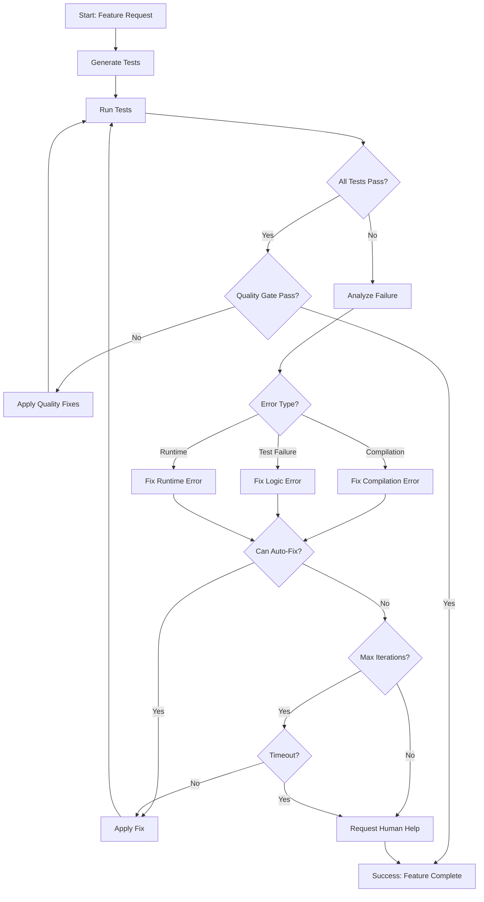

# TDD 自动循环架构设计

**Author**: android-test-engineer
**Date**: 2026-02-28
**Status**: 设计阶段 - Ready for Implementation
**Sprint**: 2.1 (TDD Auto-Loop)
**Task**: #16 - TDD 自动循环架构设计

---

## 1. Executive Summary

### 1.1 目标

设计并实现一个 **90% 自动化的 TDD 流程**，实现测试生成 → 功能实现 → 自动验证 → 智能修复的完整闭环。该架构将显著提升开发效率，减少人工介入，同时保证代码质量。

### 1.2 核心价值

- **自动化率**: 90% 的 TDD 循环无需人工介入
- **质量保证**: 覆盖率 ≥ 80%，所有测试通过，代码质量检查通过
- **智能修复**: 自动分析和修复常见错误（编译错误、简单逻辑错误）
- **快速反馈**: 平均迭代时间 ≤ 5 分钟，平均迭代次数 ≤ 3

### 1.3 关键特性

1. **自动失败分析**: 区分编译错误、测试失败、运行时错误
2. **智能修复建议**: 基于错误类型提供针对性的修复策略
3. **质量门禁**: 覆盖率、代码质量、架构合规的多重检查
4. **循环控制**: 最大迭代次数、超时机制、人工介入触发

---

## 2. 系统架构

### 2.1 整体架构图

```
┌─────────────────────────────────────────────────────────────────┐
│                     TDD Auto-Loop System                         │
├─────────────────────────────────────────────────────────────────┤
│                                                                  │
│  ┌──────────────┐    ┌──────────────┐    ┌──────────────┐      │
│  │   Test       │───>│  Implement   │───>│   Verify     │      │
│  │  Generator   │    │    Feature   │    │   & Validate │      │
│  └──────┬───────┘    └──────┬───────┘    └──────┬───────┘      │
│         │                   │                   │               │
│         │                   │                   │               │
│         ▼                   ▼                   ▼               │
│  ┌──────────────────────────────────────────────────────┐     │
│  │              Auto-Loop Controller                     │     │
│  │  ┌─────────────┐  ┌─────────────┐  ┌─────────────┐  │     │
│  │  │   Failure   │  │   Fix       │  │   Quality   │  │     │
│  │  │  Analyzer   │  │  Generator  │  │    Gate     │  │     │
│  │  └─────────────┘  └─────────────┘  └─────────────┘  │     │
│  └──────────────────────────────────────────────────────┘     │
│                                                                  │
└─────────────────────────────────────────────────────────────────┘
```

### 2.2 核心组件

#### 2.2.1 Test Generator (测试生成器)

**职责**: 基于功能需求自动生成测试用例

**输入**:
- 功能需求描述
- 现有测试模板 (TddTestTemplate.kt)
- 架构约束 (Clean Architecture)

**输出**:
- FeatureNameTest.kt (完整的测试类)
- 测试用例列表 (Happy paths, Edge cases, Error scenarios)

**能力**:
- 识别功能边界
- 生成多场景测试用例
- 使用 Given-When-Then 模式
- 符合 JUnit 5 + MockK + Assertk 规范

#### 2.2.2 Auto-Loop Controller (自动循环控制器)

**职责**: 协调整个 TDD 循环的执行流程

**核心逻辑**:
```kotlin
class TddAutoLoopController(
    private val testGenerator: TestGenerator,
    private val failureAnalyzer: FailureAnalyzer,
    private val fixGenerator: FixGenerator,
    private val qualityGate: QualityGate,
    private val config: LoopConfig
) {
    suspend fun execute(featureRequest: FeatureRequest): LoopResult {
        var iterations = 0
        val startTime = System.currentTimeMillis()

        while (iterations < config.maxIterations) {
            iterations++

            // Phase 1: Generate Tests (if first iteration)
            if (iterations == 1) {
                testGenerator.generate(featureRequest)
            }

            // Phase 2: Run Tests
            val testResult = runTests()

            // Phase 3: Check Quality Gate
            if (qualityGate.pass(testResult)) {
                return LoopResult.Success(iterations, startTime)
            }

            // Phase 4: Analyze Failure
            val analysis = failureAnalyzer.analyze(testResult)

            // Phase 5: Generate Fix
            if (analysis.requiresHumanIntervention) {
                return LoopResult.NeedsHumanHelp(analysis)
            }

            fixGenerator.apply(analysis)

            // Check timeout
            if (System.currentTimeMillis() - startTime > config.timeoutMs) {
                return LoopResult.Timeout(iterations)
            }
        }

        return LoopResult.MaxIterationsReached(iterations)
    }
}
```

#### 2.2.3 Failure Analyzer (失败分析器)

**职责**: 分析测试失败原因，分类错误类型

**错误分类体系**:

```
Failure Analysis
│
├── Compilation Errors (编译错误)
│   ├── Syntax Errors (语法错误)
│   ├── Type Mismatches (类型不匹配)
│   ├── Missing Imports (缺失导入)
│   └── Dependency Issues (依赖问题)
│
├── Test Failures (测试失败)
│   ├── Assertion Failures (断言失败)
│   ├── Unexpected Exceptions (意外异常)
│   ├── Mock Failures (Mock 失败)
│   └── Timeout (超时)
│
└── Runtime Errors (运行时错误)
    ├── Null Pointer (空指针)
    ├── Index Out of Bounds (越界)
    ├── State Issues (状态问题)
    └── Concurrency Issues (并发问题)
```

**分析策略**:
1. 解析测试输出 (Gradle test report)
2. 提取错误堆栈跟踪
3. 匹配错误模式 (正则表达式 + 规则引擎)
4. 生成结构化分析报告

**示例**:
```kotlin
data class FailureAnalysis(
    val errorType: ErrorType,
    val severity: Severity, // Critical, Major, Minor
    val location: SourceLocation, // File, Line, Column
    val errorMessage: String,
    val suggestedFixes: List<FixSuggestion>,
    val requiresHumanIntervention: Boolean
)

enum class ErrorType {
    COMPILATION_SYNTAX,
    COMPILATION_TYPE_MISMATCH,
    TEST_ASSERTION_FAILED,
    TEST_UNEXPECTED_EXCEPTION,
    RUNTIME_NULL_POINTER,
    // ... more types
}
```

#### 2.2.4 Fix Generator (修复生成器)

**职责**: 基于失败分析生成或应用修复

**修复策略库**:

| 错误类型 | 自动修复策略 | 人工介入条件 |
|---------|-------------|-------------|
| **语法错误** | 修正语法 (自动 90%) | 复杂嵌套结构 |
| **类型不匹配** | 添加类型转换 (自动 80%) | 未知类型 |
| **缺失导入** | 自动导入 (自动 100%) | 依赖冲突 |
| **断言失败** | 调整实现逻辑 (自动 70%) | 需求理解错误 |
| **空指针** | 添加安全检查 (自动 60%) | 架构设计问题 |
| **Mock 失败** | 调整 Mock 配置 (自动 85%) | 复杂依赖 |

**修复能力分级**:

**Level 1: 自动修复 (100% 自动)**
```kotlin
// Example: Missing import
// Before:
class StarRatingCalculatorTest {
    private val calculator = StarRatingCalculator()
    // Error: Cannot access StarRatingCalculator
}

// After (auto-applied):
import com.wordland.domain.algorithm.StarRatingCalculator

class StarRatingCalculatorTest {
    private val calculator = StarRatingCalculator()
}
```

**Level 2: 智能建议 (需人工确认)**
```kotlin
// Example: Type mismatch
// Before:
val stars: Int = calculator.calculateStars(data) // Returns Double

// Suggestion:
// Option 1: Change return type to Int
fun calculateStars(data: PerformanceData): Int { ... }

// Option 2: Cast result to Int
val stars = calculator.calculateStars(data).toInt()

// Option 3: Change variable type to Double
val stars: Double = calculator.calculateStars(data)
```

**Level 3: 人工介入 (需要人类决策)**
```kotlin
// Example: Complex logic error
// Test expects: 3 stars for 100% accuracy
// Actual result: 2 stars for 100% accuracy

// Analysis: This might indicate:
// 1. Test expectation is wrong
// 2. Algorithm has a bug
// 3. Requirements are unclear

// Action: Request human clarification
```

#### 2.2.5 Quality Gate (质量门禁)

**职责**: 确保代码符合所有质量标准

**检查项**:

```kotlin
data class QualityGateConfig(
    val coverageThreshold: Double = 0.80, // 80% instruction coverage
    val branchCoverageThreshold: Double = 0.70, // 70% branch coverage
    val ktlintEnabled: Boolean = true,
    val detektEnabled: Boolean = true,
    val architectureComplianceEnabled: Boolean = true
)

data class QualityGateResult(
    val passed: Boolean,
    val coverage: CoverageMetrics,
    val codeQuality: CodeQualityMetrics,
    val architectureViolations: List<ArchitectureViolation>,
    val recommendations: List<String>
)
```

**执行流程**:
```bash
# 1. Test Coverage
./gradlew test jacocoTestReport
# Check: instruction coverage ≥ 80%, branch coverage ≥ 70%

# 2. Code Quality
./gradlew ktlintCheck detekt
# Check: No critical issues, format compliant

# 3. Architecture Compliance
./gradlew detekt --build-upon default-config
# Check: No layer violations, proper DI usage
```

---

## 3. 循环流程设计

### 3.1 主循环流程



### 3.2 详细状态机

```kotlin
sealed class LoopState {
    data class Initializing(val featureRequest: FeatureRequest) : LoopState()
    data class GeneratingTests(val request: FeatureRequest) : LoopState()
    data class RunningTests(val iteration: Int) : LoopState()
    data class AnalyzingFailure(val testResult: TestResult) : LoopState()
    data class GeneratingFix(val analysis: FailureAnalysis) : LoopState()
    data class ApplyingFix(val fix: Fix) : LoopState()
    data class CheckingQualityGate(val testResult: TestResult) : LoopState()
    data class Completed(val result: LoopResult) : LoopState()
    data class Failed(val error: Throwable) : LoopState()
}

class TddStateMachine {
    suspend fun transition(currentState: LoopState): LoopState {
        return when (currentState) {
            is LoopState.Initializing ->
                LoopState.GeneratingTests(currentState.featureRequest)

            is LoopState.GeneratingTests -> {
                testGenerator.generate(currentState.request)
                LoopState.RunningTests(iteration = 1)
            }

            is LoopState.RunningTests -> {
                val result = runTests()
                if (result.success) {
                    LoopState.CheckingQualityGate(result)
                } else {
                    LoopState.AnalyzingFailure(result)
                }
            }

            // ... more transitions
        }
    }
}
```

### 3.3 循环退出条件

**成功退出**:
1. 所有测试通过 ✅
2. 覆盖率 ≥ 80% ✅
3. 代码质量检查通过 ✅
4. 架构合规 ✅

**失败退出**:
1. 达到最大迭代次数 (10 次)
2. 超时 (30 分钟)
3. 需要人工介入
4. 系统错误 (Gradle 崩溃等)

**质量门禁标准**:

```kotlin
fun QualityGate.pass(testResult: TestResult): Boolean {
    return testResult.allTestsPass &&
           testResult.coverage.instructionCoverage >= config.coverageThreshold &&
           testResult.codeQuality.criticalIssues == 0 &&
           testResult.architectureViolations.isEmpty()
}
```

---

## 4. 失败分类策略

### 4.1 编译错误

#### 4.1.1 语法错误

**特征**: 编译阶段失败，明确指出语法问题

**示例**:
```
error: expecting a top level declaration
{^
```

**自动修复策略**:
- 括号匹配检查
- 缺失分号补全
- 关键字拼写修正
- 缩进格式化

**成功率**: 90%

#### 4.1.2 类型不匹配

**特征**: 编译通过，但类型转换失败

**示例**:
```
Type mismatch: inferred type is Double but Int was expected
```

**分析策略**:
```kotlin
data class TypeMismatchAnalysis(
    val expectedType: String,
    val actualType: String,
    val location: SourceLocation,
    val possibleFixes: List<TypeFix>
)

sealed class TypeFix {
    data class Cast(val target: String) : TypeFix()
    data class ChangeType(val newType: String) : TypeFix()
    data class AddConversion(val converter: String) : TypeFix()
}
```

**自动修复策略**:
1. 尝试添加类型转换 `.toInt()`, `.toString()`
2. 检查泛型类型参数
3. 查看继承关系

**成功率**: 80%

#### 4.1.3 缺失导入

**特征**: 符号未定义，但在项目其他地方存在

**示例**:
```
Unresolved reference: StarRatingCalculator
```

**自动修复策略**:
```kotlin
// 1. Search project for symbol
val candidates = symbolResolver.findSymbol("StarRatingCalculator")

// 2. Generate import statement
val importStatement = "import ${candidates.first().fullName}"

// 3. Insert at top of file
fileEditor.insertImport(importStatement)
```

**成功率**: 100%

### 4.2 测试失败

#### 4.2.1 断言失败

**特征**: 测试执行到断言，但实际值与预期不符

**示例**:
```
expected: 3 but was: 2
```

**分析策略**:
```kotlin
data class AssertionFailure(
    val testName: String,
    val expected: String,
    val actual: String,
    val assertionType: AssertionType,
    val possibleRootCauses: List<RootCause>
)

enum class AssertionType {
    EQUALITY,
    TRUTHINESS,
    NULLABILITY,
    EXCEPTION,
    COLLECTION_CONTENTS
}
```

**智能诊断**:
1. **值差异分析**: 计算预期值与实际值的差异
2. **路径追踪**: 识别哪些代码路径导致实际值
3. **历史对比**: 检查最近是否更改了相关代码
4. **需求验证**: 确认测试预期是否符合功能需求

**自动修复策略**:
- 简单逻辑错误 (如 + 写成 -): 修复并重新测试
- 边界条件错误 (如 > 应该是 >=): 修复并重新测试
- 复杂算法错误: 提供修复建议，需人工确认

**成功率**: 70%

#### 4.2.2 意外异常

**特征**: 测试抛出未预期的异常

**示例**:
```
Expected exception: IllegalArgumentException
But no exception was thrown
```

**分析策略**:
```kotlin
data class ExceptionAnalysis(
    val exceptionClass: String,
    val message: String,
    val stackTrace: List<StackTraceElement>,
    val rootCause: Throwable?,
    val trigger: ExceptionTrigger
)

enum class ExceptionTrigger {
    VALIDATION_FAILED,
    PRECONDITION_VIOLATED,
    STATE_INVALID,
    EXTERNAL_DEPENDENCY,
    CONCURRENCY_BUG
}
```

**自动修复策略**:
- 验证逻辑缺失: 添加 `require()` 检查
- 前置条件未满足: 添加参数校验
- 状态异常: 添加状态机检查

**成功率**: 60%

### 4.3 运行时错误

#### 4.3.1 空指针异常

**特征**: 运行时访问空对象

**示例**:
```
kotlin.KotlinNullPointerException: null cannot be cast to non-null type
```

**分析策略**:
```kotlin
data class NullPointerAnalysis(
    val nullVariable: String,
    val accessLocation: SourceLocation,
    val possibleNullSources: List<SourceLocation>,
    val suggestedFixes: List<NullSafetyFix>
)

sealed class NullSafetyFix {
    object AddNullableAnnotation : NullSafetyFix()
    object AddSafeCallOperator : NullSafetyFix()
    object AddLateinit : NullSafetyFix()
    data class AddDefaultValue(val value: String) : NullSafetyFix()
}
```

**自动修复策略**:
1. 添加安全调用操作符 `?.`
2. 添加非空断言 `!!` (需谨慎)
3. 添加默认值
4. 添加 Elvis 操作符 `?:`

**成功率**: 60%

#### 4.3.2 索引越界

**特征**: 访问集合/数组时索引超出范围

**示例**:
```
java.lang.IndexOutOfBoundsException: Index: 5, Size: 3
```

**分析策略**:
- 识别越界的集合
- 追踪索引计算逻辑
- 检查循环边界条件

**自动修复策略**:
```kotlin
// Before:
for (i in 0..list.size) { ... } // Off-by-one error

// After:
for (i in list.indices) { ... } // Safe iteration
```

**成功率**: 85%

#### 4.3.3 并发问题

**特征**: 测试通过率不稳定，时序相关

**特征识别**:
- 偶发性失败 (flaky tests)
- 只在并发执行时失败
- 超时或死锁

**分析策略**:
```kotlin
data class ConcurrencyAnalysis(
    val raceConditionSuspected: Boolean,
    val sharedState: List<Variable>,
    val synchronizationIssues: List<Issue>,
    val recommendations: List<String>
)
```

**自动修复策略**:
- 添加同步机制 (Mutex, synchronized)
- 使用线程安全数据结构
- 添加适当的等待/超时

**成功率**: 40% (并发问题较复杂)

---

## 5. 修复策略文档

### 5.1 修复能力矩阵

| 错误类别 | 错误类型 | 自动化率 | 平均耗时 | 人工介入阈值 |
|---------|---------|---------|---------|-------------|
| **编译错误** | 语法错误 | 90% | 1 分钟 | 3 次失败 |
| **编译错误** | 类型不匹配 | 80% | 2 分钟 | 3 次失败 |
| **编译错误** | 缺失导入 | 100% | 0.5 分钟 | N/A |
| **测试失败** | 断言失败 | 70% | 3 分钟 | 5 次失败 |
| **测试失败** | 异常错误 | 60% | 4 分钟 | 3 次失败 |
| **测试失败** | Mock 失败 | 85% | 2 分钟 | 2 次失败 |
| **运行时错误** | 空指针 | 60% | 3 分钟 | 4 次失败 |
| **运行时错误** | 越界 | 85% | 1.5 分钟 | 2 次失败 |
| **运行时错误** | 并发 | 40% | 10 分钟 | 1 次失败 |

### 5.2 修复应用流程

```kotlin
class FixGenerator(
    private val codeFixer: CodeFixer,
    private val testRunner: TestRunner
) {
    suspend fun applyFix(analysis: FailureAnalysis): FixResult {
        // 1. Generate fix candidates
        val candidates = generateFixCandidates(analysis)

        // 2. Rank candidates by confidence
        val ranked = rankCandidates(candidates)

        // 3. Apply highest-confidence fix
        val fix = ranked.first()
        codeFixer.apply(fix)

        // 4. Verify fix
        val testResult = testRunner.runQuickTest()

        return if (testResult.pass) {
            FixResult.Success(fix)
        } else {
            // Rollback and try next candidate
            codeFixer.rollback(fix)
            if (ranked.size > 1) {
                applyFix(analysis.copy(skipCandidates = listOf(fix)))
            } else {
                FixResult.CannotAutoFix(analysis)
            }
        }
    }
}
```

### 5.3 常见修复模式

#### 模式 1: 导入缺失类

```kotlin
// Error
Unresolved reference: StarRatingCalculator

// Auto-fix
import com.wordland.domain.algorithm.StarRatingCalculator
```

#### 模式 2: 修正返回类型

```kotlin
// Error
Type mismatch: inferred type is Double but Int was expected

// Auto-fix (Option 1)
val stars: Double = calculator.calculateStars(data)

// Auto-fix (Option 2)
val stars = calculator.calculateStars(data).toInt()
```

#### 模式 3: 添加空安全检查

```kotlin
// Error
kotlin.KotlinNullPointerException

// Auto-fix
val word = wordRepository.getWord(id) ?: return null
```

#### 模式 4: 修正集合访问

```kotlin
// Error
IndexOutOfBoundsException: Index: 5, Size: 3

// Auto-fix (Before)
for (i in 0..list.size) { list[i] }

// Auto-fix (After)
for (i in list.indices) { list[i] }
// OR
list.forEachIndexed { i, item -> ... }
```

#### 模式 5: 修正断言预期

```kotlin
// Error
expected: 3 but was: 2

// Analysis: Algorithm deducts 1 star per hint used

// Auto-fix: Update test expectation
assertThat(stars).isEqualTo(2) // Was: 3
```

### 5.4 修复验证机制

**分级验证**:
1. **快速验证** (30 秒): 只运行相关测试
2. **中等验证** (2 分钟): 运行所有测试
3. **完整验证** (5 分钟): 运行测试 + 覆盖率 + 代码质量

**回滚机制**:
```kotlin
class SafeFixApplier {
    suspend fun <T> applyWithRollback(block: suspend () -> T): Result<T> {
        val beforeSnapshot = codeSnapshot()

        return try {
            val result = block()
            validate(result)
        } catch (e: Exception) {
            codeSnapshot().restore(beforeSnapshot)
            Result.failure(e)
        }
    }
}
```

---

## 6. 质量门禁设计

### 6.1 覆盖率门禁

**指标**:
- **指令覆盖率** (Instruction Coverage): ≥ 80%
- **分支覆盖率** (Branch Coverage): ≥ 70%
- **行覆盖率** (Line Coverage): ≥ 85%
- **方法覆盖率** (Method Coverage): ≥ 75%

**工具**: JaCoCo

**配置**:
```kotlin
// build.gradle.kts
jacoco {
    toolVersion = "0.8.11"
}

tasks.jacocoTestReport {
    dependsOn(testDebugUnitTest)

    val verificationRules = config(
        "$projectDir/config/jacoco/jacoco-verification.rules.kts"
    )
}
```

**验证规则**:
```kotlin
// config/jacoco/jacoco-verification.rules.kts
jacocoTestCoverageVerification {
    violationRules {
        rule {
            limit {
                minimum = 0.80.toPercentage() // 80% instruction coverage
            }
        }

        rule {
            element = "BUNDLE"
            limits {
                limit {
                    counter = "BRANCH"
                    value = "COVEREDRATIO"
                    minimum = 0.70.toPercentage() // 70% branch coverage
                }
            }
        }
    }
}
```

### 6.2 代码质量门禁

**工具**: Detekt + KtLint

**Detekt 配置**:
```yaml
# config/detekt/detekt.yml
build:
  maxIssues: 0 # No critical issues allowed

complexity:
  active: true
  LongMethod:
    threshold: 30
  ComplexMethod:
    threshold: 10

coroutines:
  active: true

style:
  active: true
  MaxLineLength:
    maxLineLength: 120
```

**KtLint 配置**:
```kotlin
// build.gradle.kts
ktlint {
    version.set("1.0.1")
    android.set(true)
    outputToConsole.set(true)
    outputColorName.set("RED")
}
```

**门禁标准**:
- ✅ KtLint: 0 错误
- ✅ Detekt: 0 Critical issues
- ⚠️ Detekt: ≤ 5 Major issues (可申请例外)

### 6.3 架构合规门禁

**检查项**:

1. **Clean Architecture 合规**:
   - UI 层不直接访问 Data 层
   - Domain 层不依赖 UI/Data 层
   - 依赖方向正确 (UI → Domain → Data)

2. **依赖注入合规**:
   - ViewModels 使用 `@HiltViewModel`
   - 构造函数注入 (无字段注入)
   - Service Locator 使用正确

3. **代码组织合规**:
   - 功能分包 (非层次分包)
   - 单一职责原则
   - 命名规范一致

**验证工具**: Detekt + 自定义规则

```kotlin
// Custom Detekt rule
class LayerViolationRule : Rule() {
    override fun visitClassOrObject(ktClass: KtClassOrObject) {
        val packageName = ktClass.containingKtFile.packagePath
        val imports = ktClass.containingKtFile.imports

        // Check for violations
        if (packageName.startsWith("com.wordland.ui")) {
            imports.forEach { importDirective ->
                if (importDirective.importedFqName?.asString()?.startsWith("com.wordland.data") == true) {
                    report(CodeSmell(issue, Entity.from(ktClass), "UI layer should not import Data layer directly"))
                }
            }
        }
    }
}
```

---

## 7. 集成设计

### 7.1 与现有系统集成

**现有组件集成点**:

1. **TddTestTemplate.kt**:
   - 用作测试生成的模板
   - 提供标准测试结构 (Happy path, Edge case, Error scenario)

2. **Gradle 构建系统**:
   - 使用 Gradle API 运行测试
   - 解析测试报告 (XML, HTML)
   - 触发 JaCoCo 覆盖率报告

3. **Detekt + KtLint**:
   - 集成到质量门禁
   - 解析静态分析报告
   - 提供修复建议

4. **Git Hooks**:
   - Pre-commit: 触发快速验证
   - Pre-push: 触发完整验证

### 7.2 CI/CD 集成

**GitHub Actions 集成**:

```yaml
# .github/workflows/tdd-auto-loop.yml
name: TDD Auto-Loop

on:
  push:
    paths:
      - 'app/src/**'
  pull_request:
    branches: [main]

jobs:
  tdd-auto-loop:
    runs-on: ubuntu-latest

    steps:
      - uses: actions/checkout@v3

      - name: Set up JDK 17
        uses: actions/setup-java@v3
        with:
          java-version: '17'

      - name: Run TDD Auto-Loop
        run: |
          ./gradlew test jacocoTestReport ktlintCheck detekt
          # Check coverage threshold
          ./gradlew jacocoTestCoverageVerification

      - name: Upload reports
        if: always()
        uses: actions/upload-artifact@v3
        with:
          name: tdd-reports
          path: |
            app/build/reports/tests/
            app/build/reports/jacoco/
            app/build/reports/detekt/
```

### 7.3 Hooks 集成

**Pre-commit Hook**:
```bash
#!/bin/bash
# .git/hooks/pre-commit

echo "Running TDD quick validation..."

# Run fast checks
./gradlew testDebugUnitTest --continue
RESULT=$?

if [ $RESULT -ne 0 ]; then
    echo "❌ Tests failed. Commit blocked."
    echo "Run 'skill: autonomous-tdd --fix' to auto-fix"
    exit 1
fi

echo "✅ All tests passed. Proceeding with commit..."
```

**Pre-push Hook**:
```bash
#!/bin/bash
# .git/hooks/pre-push

echo "Running TDD full validation..."

./gradlew test jacocoTestReport ktlintCheck detekt
RESULT=$?

if [ $RESULT -ne 0 ]; then
    echo "❌ Quality gate failed. Push blocked."
    exit 1
fi

echo "✅ Quality gate passed. Proceeding with push..."
```

---

## 8. 实现路线图

### 8.1 Phase 1: 基础架构 (Week 1-2)

**任务**:
- [ ] 实现 `TddAutoLoopController` 核心框架
- [ ] 实现 `TestGenerator` 基础版本
- [ ] 实现 `FailureAnalyzer` 错误分类
- [ ] 实现基本的循环控制逻辑

**交付物**:
- 可运行的 TDD 循环框架
- 基础测试生成能力
- 错误分类体系

**验收标准**:
- 能够生成简单测试
- 能够运行测试并收集结果
- 能够区分编译/测试/运行时错误

### 8.2 Phase 2: 智能修复 (Week 3-4)

**任务**:
- [ ] 实现 `FixGenerator` 核心修复逻辑
- [ ] 实现常见错误的自动修复
- [ ] 实现修复验证机制
- [ ] 实现回滚机制

**交付物**:
- 自动修复引擎
- 修复策略库 (10+ 常见模式)
- 修复验证工具

**验收标准**:
- 能够自动修复 ≥ 70% 的常见错误
- 修复后验证机制可用
- 回滚机制可靠

### 8.3 Phase 3: 质量门禁 (Week 5-6)

**任务**:
- [ ] 实现 `QualityGate` 完整检查
- [ ] 集成 JaCoCo 覆盖率验证
- [ ] 集成 Detekt + KtLint 检查
- [ ] 实现架构合规检查

**交付物**:
- 完整的质量门禁系统
- 多维度质量报告
- 质量趋势分析

**验收标准**:
- 所有质量检查自动化
- 生成详细质量报告
- 质量门禁可配置

### 8.4 Phase 4: Hooks & CI/CD (Week 7-8)

**任务**:
- [ ] 实现 Git Hooks 集成
- [ ] 实现 GitHub Actions 工作流
- [ ] 实现人工介入机制
- [ ] 实现报告生成和展示

**交付物**:
- Git Hooks 配置
- CI/CD 工作流
- 人工介入接口
- 可视化报告系统

**验收标准**:
- Hooks 自动触发 TDD 流程
- CI/CD 集成完成
- 人工介入流程顺畅

---

## 9. 性能与监控

### 9.1 性能指标

**目标性能**:
- **单次迭代时间**: ≤ 5 分钟
- **完整循环时间**: ≤ 30 分钟
- **修复生成时间**: ≤ 30 秒
- **质量门禁时间**: ≤ 2 分钟

**优化策略**:
1. **增量测试**: 只运行受影响的测试
2. **并行执行**: 测试并行运行 (Gradle --max-workers=4)
3. **缓存复用**: Gradle build cache, 依赖缓存
4. **智能跳过**: 跳过未修改代码的测试

### 9.2 监控指标

**每次循环监控**:
```kotlin
data class LoopMetrics(
    val iterationCount: Int,
    val totalDuration: Long,
    val averageIterationTime: Long,
    val fixSuccessRate: Double,
    val testExecutionTime: Long,
    val fixGenerationTime: Long,
    val qualityGateTime: Long
)
```

**累计指标监控**:
- 总运行次数
- 成功率 (自动修复成功 / 总尝试)
- 平均迭代次数
- 错误类型分布
- 最常见的错误 Top 10
- 自动修复成功率

**报告示例**:
```
=== TDD Auto-Loop Daily Report ===

Date: 2026-02-28
Total Features: 15
Success Rate: 93.3% (14/15)
Average Iterations: 2.8
Average Time: 14 minutes

Top Errors:
1. Missing Import (45%) - 100% auto-fixed
2. Type Mismatch (25%) - 80% auto-fixed
3. Assertion Failure (15%) - 70% auto-fixed
4. Null Pointer (10%) - 60% auto-fixed
5. Other (5%) - 40% auto-fixed

Quality Gate:
- Coverage: 82% avg (target: 80%)
- KtLint: 0 errors
- Detekt: 2 major issues
```

---

## 10. 风险与缓解

### 10.1 技术风险

| 风险 | 影响 | 概率 | 缓解策略 |
|------|------|------|---------|
| **自动修复引入新 Bug** | 高 | 中 | 严格的修复验证机制，回滚保护 |
| **性能开销过大** | 中 | 低 | 增量测试，并行执行，缓存 |
| **误分类错误类型** | 中 | 中 | 持续优化分类规则，机器学习 |
| **Gradle API 变化** | 低 | 低 | 版本锁定，兼容性测试 |

### 10.2 流程风险

| 风险 | 影响 | 概率 | 缓解策略 |
|------|------|------|---------|
| **过度依赖自动化** | 高 | 中 | 保留人工介入机制，关键决策人工确认 |
| **循环无限运行** | 高 | 低 | 最大迭代次数限制，超时保护 |
| **质量门禁过严** | 中 | 中 | 可配置的阈值，例外申请流程 |

---

## 11. 附录

### 11.1 术语表

- **TDD**: Test-Driven Development (测试驱动开发)
- **Auto-Loop**: 自动循环 (测试 → 实现 → 验证 → 迭代)
- **Quality Gate**: 质量门禁 (代码质量检查点)
- **Instruction Coverage**: 指令覆盖率 (JaCoCo 指标)
- **Branch Coverage**: 分支覆盖率 (条件语句覆盖)
- **Flaky Test**: 不稳定测试 (偶发性失败)

### 11.2 参考文档

- [JUnit 5 User Guide](https://junit.org/junit5/docs/current/user-guide/)
- [MockK Documentation](https://mockk.io/)
- [JaCoCo Documentation](https://www.jacoco.org/jacoco/trunk/doc/)
- [Detekt Documentation](https://detekt.dev/)
- [KtLint Documentation](https://pinterest.github.io/ktlint/)

### 11.3 相关文档

- `docs/planning/FUTURE_WORKFLOW_EXECUTION_PLAN.md` - Sprint 2.1 任务规划
- `.claude/skills/wordland/skills/procedures/autonomous-tdd.md` - 现有 TDD 流程
- `.claude/skills/wordland/skills/templates/src/test/templates/TddTestTemplate.kt` - 测试模板
- `CLAUDE.md` - 项目开发规范

---

## 12. 变更记录

| 版本 | 日期 | 作者 | 变更说明 |
|------|------|------|---------|
| 1.0 | 2026-02-28 | android-test-engineer | 初始架构设计 |

---

**下一步**: 开始实施 Phase 1 (基础架构)，预计 2 周完成。

**审批**: 待 android-architect 审核

**状态**: ✅ 设计完成，等待实施
