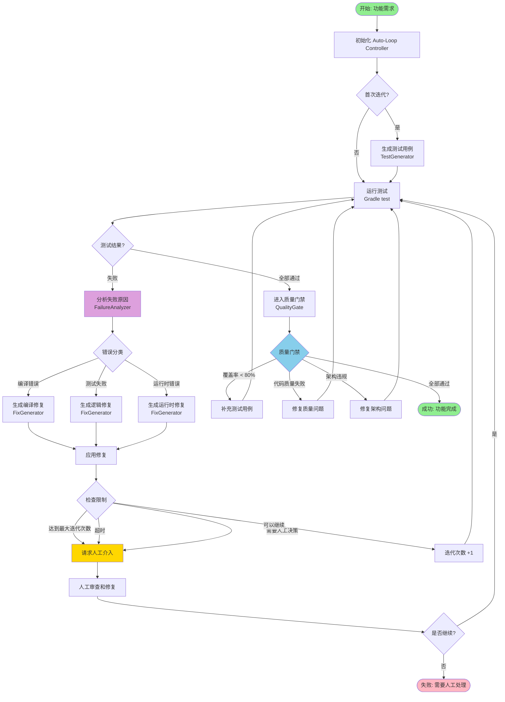
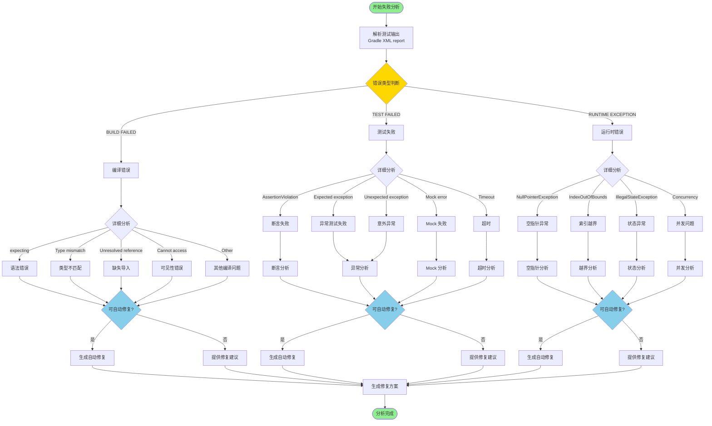
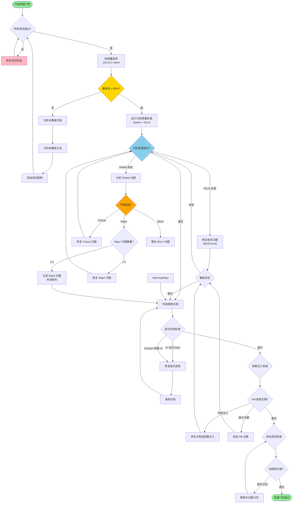
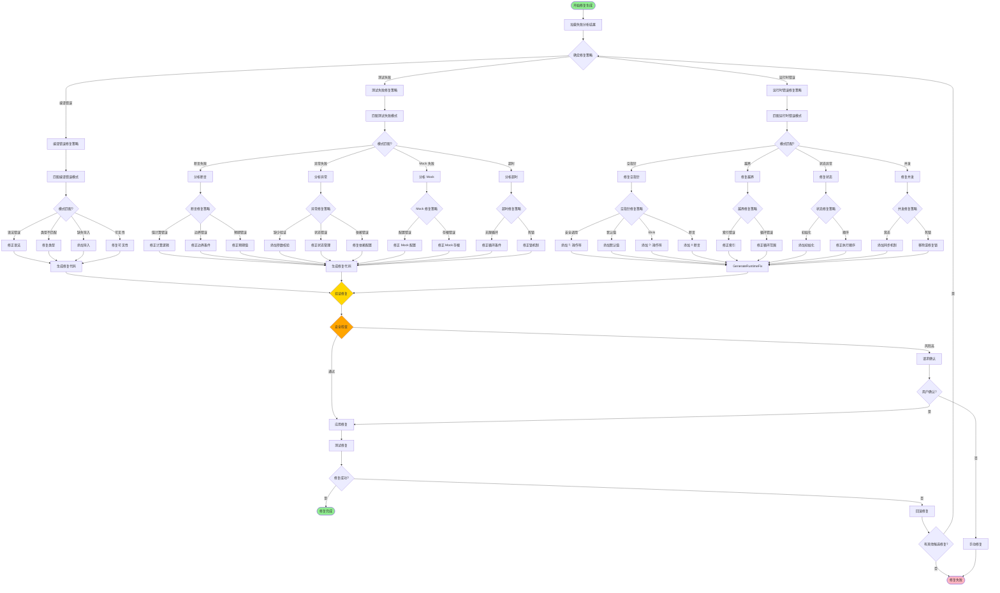
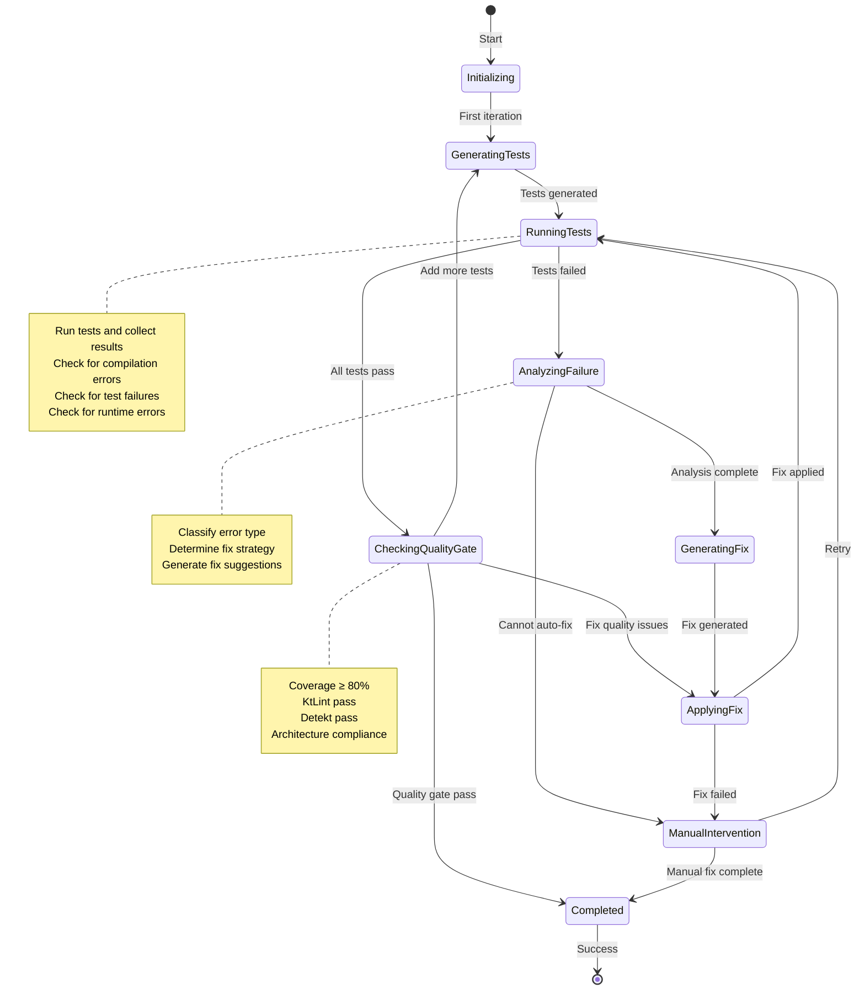
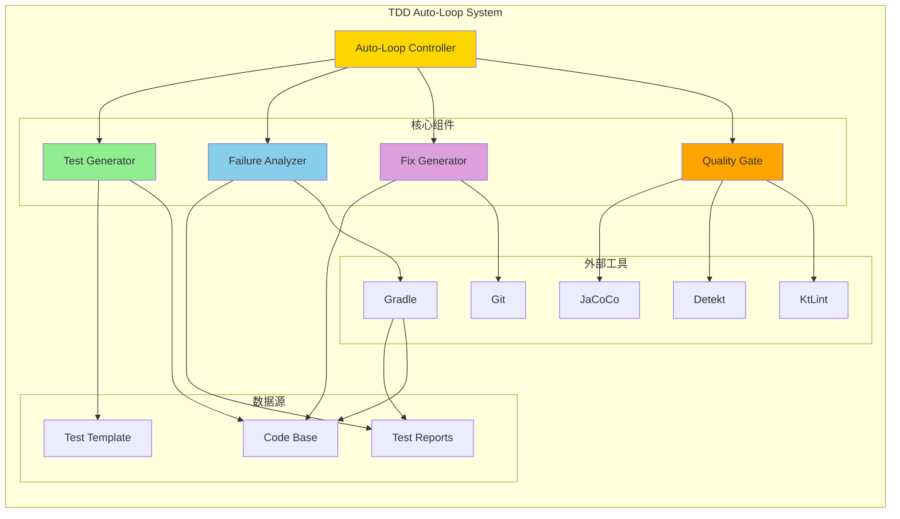
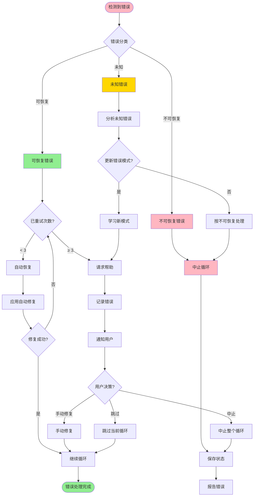
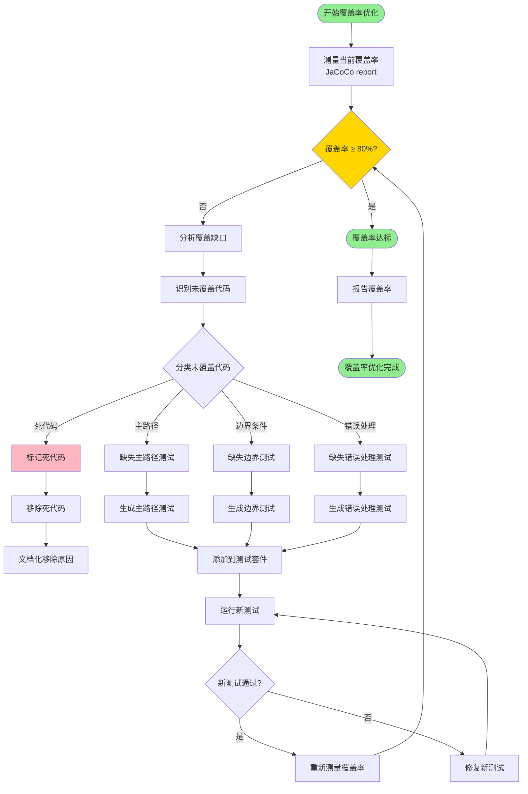

# TDD Auto-Loop 流程图

**Document Version**: 1.0
**Last Updated**: 2026-02-28
**Author**: android-test-engineer

本文档提供 TDD Auto-Loop 系统的各种流程图，用于理解系统的工作流程和决策逻辑。

---

## 1. 主循环流程图



---

## 2. 失败分析决策树



---

## 3. 质量门禁流程图



---

## 4. 修复生成流程图



---

## 5. 状态机图



---

## 6. 时序图

```mermaid
sequenceDiagram
    participant User as 用户/需求
    participant Controller as Auto-Loop Controller
    participant TestGen as Test Generator
    participant Gradle as Gradle
    participant Analyzer as Failure Analyzer
    participant FixGen as Fix Generator
    participant QualityGate as Quality Gate
    participant Repo as 代码仓库

    User->>Controller: 提交功能需求

    Controller->>TestGen: 生成测试用例
    TestGen-->>Controller: 测试文件创建

    Controller->>Gradle: 运行测试
    Gradle-->>Controller: 测试结果

    alt 测试失败
        Controller->>Analyzer: 分析失败原因
        Analyzer-->>Controller: 失败分析报告

        Controller->>FixGen: 生成修复方案
        FixGen-->>Controller: 修复代码

        Controller->>Repo: 应用修复
        Repo-->>Controller: 修复已应用

        Controller->>Gradle: 重新运行测试
    else 测试通过
        Controller->>QualityGate: 质量门禁检查

        alt 质量门禁失败
            QualityGate-->>Controller: 质量问题报告
            Controller->>FixGen: 生成质量修复
        else 质量门禁通过
            QualityGate-->>Controller: 质量验证通过
            Controller-->>User: 功能完成
        end
    end

    note over Controller,Repo
        最多迭代 10 次
        超时 30 分钟
        失败则请求人工介入
    end note
```

---

## 7. 组件交互图



---

## 8. 错误处理流程图



---

## 9. 覆盖率优化流程图



---

## 10. 使用指南

### 10.1 如何使用这些流程图

1. **理解系统**: 从"主循环流程图"开始，了解整个 TDD Auto-Loop 的工作流程
2. **深入分析**: 查看"失败分析决策树"，理解错误如何被分类和分析
3. **质量保证**: 参考"质量门禁流程图"，了解质量检查的完整流程
4. **修复机制**: 查看"修复生成流程图"，理解自动修复如何工作
5. **状态管理**: 使用"状态机图"理解系统的各种状态转换
6. **交互流程**: 查看"时序图"和"组件交互图"，理解组件间的协作

### 10.2 流程图维护

- **更新频率**: 每次架构变更后更新
- **责任人**: android-architect + android-test-engineer
- **审核周期**: 每个 Sprint 审核 1 次
- **版本控制**: 使用 Git 追踪所有变更

---

**文档结束**

**相关文档**:
- `TDD_AUTO_LOOP_ARCHITECTURE.md` - 完整架构设计
- `TDD_FAILURE_CLASSIFICATION.md` - 失败分类策略
- `TDD_FIX_STRATEGIES.md` - 修复策略文档
