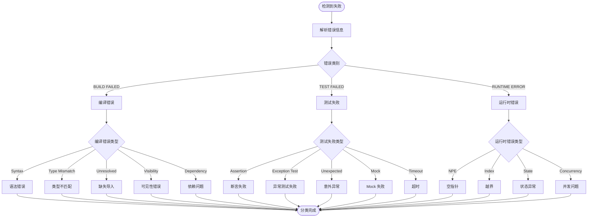

# TDD 失败分类策略

**Document Version**: 1.0
**Last Updated**: 2026-02-28
**Author**: android-test-engineer

本文档详细定义 TDD Auto-Loop 系统中的失败分类策略，包括错误类型识别、分类规则、处理优先级和自动化能力。

---

## 1. 分类体系概述

### 1.1 三级分类层次

```
Failure Category (一级)
  └─ Failure Type (二级)
      └─ Failure Pattern (三级)
```

**示例**:
```
Compilation Errors (一级)
  └─ Syntax Errors (二级)
      └─ Missing Semicolon (三级)
```

### 1.2 分类维度

| 维度 | 说明 | 示例 |
|------|------|------|
| **错误阶段** | 编译期、测试期、运行时 | 编译错误、测试失败、运行时异常 |
| **错误严重性** | Critical, Major, Minor | 语法错误 (Critical)、格式问题 (Minor) |
| **自动修复能力** | 100%, 80%, 60%, 40%, 0% | 缺失导入 (100%)、并发问题 (40%) |
| **人工介入阈值** | 失败几次后请求人工 | 3 次失败后请求人工 |

---

## 2. 编译错误 (Compilation Errors)

### 2.1 语法错误 (Syntax Errors)

**特征**: 代码语法不符合 Kotlin 语法规则

**模式识别**:
```kotlin
// 正则表达式模式
val syntaxPatterns = listOf(
    """expecting.*top level declaration""".toRegex(),
    """unexpected.*tokens""".toRegex(),
    """mismatched.*input""".toRegex(),
    """missing.*\}""".toRegex(),
    """unterminated.*string""".toRegex()
)
```

**示例**:
```kotlin
// Error: expecting a top level declaration
{^

// Error: unexpected tokens (use ';' to separate expressions)
val a = 1 val b = 2

// Error: unterminated string literal
val s = "hello
```

**修复策略**:
1. 括号匹配检查和修复
2. 缺失分号补全
3. 字符串终止符补全
4. 关键字拼写修正

**自动修复成功率**: 90%
**人工介入阈值**: 3 次失败

**优先级**: Critical (阻止编译)

---

### 2.2 类型不匹配 (Type Mismatches)

**特征**: 类型推断或赋值时类型不兼容

**模式识别**:
```kotlin
val typeMismatchPatterns = listOf(
    """Type mismatch.*inferred type is (\w+).*but (\w+) was expected""".toRegex(),
    """cannot cast (\w+) to (\w+)""".toRegex(),
    """required.*(\w+).*found.*(\w+)""".toRegex()
)
```

**示例**:
```kotlin
// Error: Type mismatch: inferred type is Double but Int was expected
val stars: Int = calculateStars() // Returns Double

// Error: Required String, found Int
val name: String = 123

// Error: Cannot cast Nothing to String
val x = obj as String // obj is Nothing?
```

**分析策略**:
```kotlin
data class TypeMismatchAnalysis(
    val expectedType: KotlinType,
    val actualType: KotlinType,
    val location: SourceLocation,
    val typeRelationship: TypeRelationship,
    val possibleFixes: List<TypeFix>
)

enum class TypeRelationship {
    SUPERTYPE,           // 实际类型是预期类型的父类
    SUBTYPE,             // 实际类型是预期类型的子类
    COMPATIBLE,          // 可以通过转换兼容
    INCOMPATIBLE,        // 完全不兼容
    NULLABLE_MISMATCH    // 可空性不匹配
}
```

**修复策略**:
1. **类型转换**: 添加 `.toInt()`, `.toString()`
2. **修改类型**: 修改变量或函数返回类型
3. **添加转换器**: 使用自定义转换函数
4. **修复可空性**: 添加 `?` 或 `!!`

**修复示例**:
```kotlin
// 原始代码
val stars: Int = calculator.calculateStars(data)

// 修复方案 1: 类型转换
val stars = calculator.calculateStars(data).toInt()

// 修复方案 2: 修改变量类型
val stars: Double = calculator.calculateStars(data)

// 修复方案 3: 修改函数返回类型
// 在 StarRatingCalculator.kt 中:
fun calculateStars(data: PerformanceData): Int { ... }
```

**自动修复成功率**: 80%
**人工介入阈值**: 3 次失败

**优先级**: Critical (阻止编译)

---

### 2.3 缺失导入 (Missing Imports)

**特征**: 使用了未导入的类或函数

**模式识别**:
```kotlin
val missingImportPatterns = listOf(
    """Unresolved reference: (\w+)""".toRegex(),
    """Cannot access.*(\w+).*it is in different module""".toRegex()
)
```

**示例**:
```kotlin
// Error: Unresolved reference: StarRatingCalculator
val calculator = StarRatingCalculator()

// Error: Unresolved reference: assertThat
assertThat(result).isEqualTo(expected)

// Error: Unresolved reference: listOf
val list = listOf(1, 2, 3)
```

**分析策略**:
```kotlin
class ImportResolver(
    private val projectIndex: ProjectIndex
) {
    fun resolveImport(symbolName: String): ImportResolution? {
        // 1. 在项目中搜索符号
        val candidates = projectIndex.findSymbol(symbolName)

        // 2. 按相关性排序
        val ranked = rankByRelevance(candidates)

        // 3. 选择最匹配的
        return ranked.firstOrNull()?.let {
            ImportResolution(
                fullQualifiedName = it.fullName,
                importStatement = "import ${it.fullName}",
                confidence = it.score
            )
        }
    }
}
```

**修复策略**:
1. 在项目中搜索符号定义
2. 计算相关性评分 (同一模块、常用包等)
3. 生成 import 语句
4. 插入文件顶部

**自动修复成功率**: 100%
**人工介入阈值**: N/A (无需人工介入)

**优先级**: Critical (阻止编译)

---

### 2.4 可见性错误 (Visibility Errors)

**特征**: 访问了不可见的类、函数或属性

**模式识别**:
```kotlin
val visibilityPatterns = listOf(
    """Cannot access.*(\w+).*it is (\w+) in (\w+)""".toRegex(),
    """'(\w+)' in (\w+) is final""".toRegex()
)
```

**示例**:
```kotlin
// Error: Cannot access 'internalMethod': it is private in 'MyClass'
obj.internalMethod()

// Error: Cannot access 'BaseClass': it is internal in different module
class Derived : BaseClass()

// Error: 'valuable' in 'MyClass' is final, cannot be overridden
override val valuable: String
```

**修复策略**:
1. 修改访问可见性 (private → internal → public)
2. 添加 internal 可见性修饰符
3. 使用 public API 替代内部实现
4. 移除 final 修饰符

**自动修复成功率**: 70%
**人工介入阈值**: 2 次失败

**优先级**: Critical (阻止编译)

---

### 2.5 依赖问题 (Dependency Issues)

**特征**: 缺少依赖库或版本冲突

**模式识别**:
```kotlin
val dependencyPatterns = listOf(
    """Unresolved reference.*(\w+)""".toRegex(),
    """CLASS_NOT_FOUND.*(\w+)""".toRegex(),
    """Version conflict.*(\w+)""".toRegex()
)
```

**示例**:
```kotlin
// Error: Unresolved reference: MockK
import io.mockk.every

// Error: CLASS_NOT_FOUND: androidx.compose.runtime.*
import androidx.compose.runtime.*

// Error: Version conflict: com.google.dagger:dagger:2.48 vs 2.47
```

**修复策略**:
1. 检查 `build.gradle.kts` 依赖
2. 添加缺失的依赖
3. 解决版本冲突
4. 同步 Gradle

**自动修复成功率**: 60%
**人工介入阈值**: 1 次失败

**优先级**: Critical (阻止编译)

---

## 3. 测试失败 (Test Failures)

### 3.1 断言失败 (Assertion Failures)

**特征**: 测试执行到断言，但预期与实际不符

**模式识别**:
```kotlin
val assertionPatterns = listOf(
    """expected:? (.+) but was:? (.+)""".toRegex(),
    """AssertionError.*expected:? <(\d+)> but was:? <(\d+)>""".toRegex(),
    """expected true but was false""".toRegex(),
    """assertk\.assertions\.AssertionFailedError""".toRegex()
)
```

**示例**:
```kotlin
// Error: expected: 3 but was: 2
assertThat(stars).isEqualTo(3) // actual: 2

// Error: expected true but was false
assertThat(isValid).isTrue() // actual: false

// Error: expected "hello" but was "world"
assertThat(message).isEqualTo("hello") // actual: "world"
```

**分析策略**:
```kotlin
data class AssertionFailureAnalysis(
    val testName: String,
    val assertionType: AssertionType,
    val expected: Any?,
    val actual: Any?,
    val diff: String?,
    val possibleRootCauses: List<RootCause>,
    val recommendedFixes: List<FixRecommendation>
)

enum class AssertionType {
    EQUALITY,           // isEqualTo(), isNotEqualTo()
    TRUTHINESS,         // isTrue(), isFalse()
    NULLABILITY,        // isNull(), isNotNull()
    COLLECTIONS,        // isEmpty(), hasSize()
    EXCEPTIONS,         // thrownBy
    CUSTOM              // 自定义断言
}

enum class RootCause {
    TEST_EXPECTATION_WRONG,    // 测试预期错误
    IMPLEMENTATION_BUG,        // 实现错误
    CALCULATION_ERROR,         // 计算错误
    BOUNDARY_ERROR,            // 边界条件错误
    STATE_ERROR,               // 状态错误
    DATA_ERROR                 // 测试数据错误
}
```

**深度分析**:
```kotlin
class AssertionFailureAnalyzer {
    fun analyze(failure: AssertionFailure): DeepAnalysis {
        // 1. 值差异分析
        val diffAnalyzer = ValueDiffAnalyzer()
        val diff = diffAnalyzer.diff(failure.expected, failure.actual)

        // 2. 代码路径追踪
        val pathTracer = CodePathTracer()
        val executionPath = pathTracer.trace(failure.testName)

        // 3. 变量状态分析
        val stateAnalyzer = VariableStateAnalyzer()
        val states = stateAnalyzer.analyze(executionPath)

        // 4. 历史对比
        val history = GitHistoryAnalyzer()
        val recentChanges = history.getRecentChanges(
            files = executionPath.affectedFiles,
            days = 7
        )

        return DeepAnalysis(
            diff = diff,
            executionPath = executionPath,
            variableStates = states,
            recentChanges = recentChanges,
            confidence = calculateConfidence(diff, states, recentChanges)
        )
    }
}
```

**修复策略**:

**策略 1: 修正实现逻辑** (当置信度 > 80%)
```kotlin
// 原始代码
fun calculateStars(correct: Int, total: Int): Int {
    return (correct / total) * 3  // Bug: 整数除法
}

// 修复后
fun calculateStars(correct: Int, total: Int): Int {
    return ((correct.toDouble() / total) * 3).toInt()
}
```

**策略 2: 修正测试预期** (当置信度 < 50%)
```kotlin
// 原始测试
assertThat(stars).isEqualTo(3)  // 期望值错误

// 修复后
assertThat(stars).isEqualTo(2)  // 修正预期值
```

**策略 3: 提供多个选择** (当置信度 50-80%)
```kotlin
// 生成多个修复方案，供用户选择
val fixes = listOf(
    Fix("修正实现逻辑", changeImplementation),
    Fix("修正测试预期", changeTestExpectation),
    Fix("添加额外测试", addMoreTests)
)
```

**自动修复成功率**: 70%
**人工介入阈值**: 5 次失败

**优先级**: Major (测试失败)

---

### 3.2 异常测试失败 (Exception Test Failures)

**特征**: 异常测试未按预期抛出或抛出异常类型不匹配

**模式识别**:
```kotlin
val exceptionTestPatterns = listOf(
    """Expected exception (\w+) but no exception was thrown""".toRegex(),
    """Unexpected exception thrown.*expected (\w+) but was (\w+)""".toRegex(),
    """Exception type mismatch""".toRegex()
)
```

**示例**:
```kotlin
// Error: Expected exception IllegalArgumentException but no exception was thrown
@Test
fun `should throw exception when word is empty`() {
    val word = Word(id = "", word = "test")  // 没有抛出异常
}

// Error: Unexpected exception thrown
// Expected: IllegalArgumentException
// Actual: NullPointerException
```

**分析策略**:
```kotlin
data class ExceptionTestFailure(
    val expectedException: Class<out Throwable>,
    val actualException: Class<out Throwable>?,
    val exceptionMessage: String?,
    val stackTrace: List<StackTraceElement>,
    val triggerReason: ExceptionTrigger
)

enum class ExceptionTrigger {
    MISSING_VALIDATION,      // 缺少参数校验
    WRONG_EXCEPTION_TYPE,    // 异常类型错误
    PRECONDITION_NOT_MET,    // 前置条件未满足
    STATE_INVALID,           // 状态无效
    EXTERNAL_DEPENDENCY      // 外部依赖问题
}
```

**修复策略**:

**策略 1: 添加缺失的验证**
```kotlin
// 原始代码
data class Word(val id: String, val word: String)

// 修复后
data class Word(val id: String, val word: String) {
    init {
        require(id.isNotEmpty()) { "Word ID cannot be empty" }
    }
}
```

**策略 2: 修正异常类型**
```kotlin
// 原始代码
fun calculate(data: PerformanceData): Int {
    require(data.totalWords > 0) { throw NullPointerException() }
}

// 修复后
fun calculate(data: PerformanceData): Int {
    require(data.totalWords > 0) { "Total words must be positive" }
}
```

**策略 3: 修正测试预期**
```kotlin
// 原始测试
@Test
fun `should throw IllegalArgumentException`() {
    // ...
}

// 修复后
@Test
fun `should throw IllegalStateException`() {
    // ...
}
```

**自动修复成功率**: 60%
**人工介入阈值**: 3 次失败

**优先级**: Major (测试失败)

---

### 3.3 意外异常 (Unexpected Exceptions)

**特征**: 测试执行过程中抛出未预期的异常

**模式识别**:
```kotlin
val unexpectedExceptionPatterns = listOf(
    """(\w+Exception)""".toRegex(),
    """Caused by:.*(\w+)""".toRegex()
)
```

**示例**:
```kotlin
// Error: NullPointerException
// at com.wordland.StarRatingCalculator.calculate(StarRatingCalculator.kt:42)

// Error: IndexOutOfBoundsException: Index: 5, Size: 3
// at com.wordland.WordRepository.getWord(WordRepository.kt:15)

// Error: IllegalStateException: State not initialized
// at com.wordland.LearningViewModel.submitAnswer(LearningViewModel.kt:78)
```

**分析策略**:
```kotlin
data class UnexpectedExceptionAnalysis(
    val exceptionClass: String,
    val exceptionMessage: String,
    val stackTrace: List<StackTraceElement>,
    val rootCause: Throwable?,
    val suspectVariables: List<Variable>,
    val possibleFixes: List<FixSuggestion>
)
```

**修复策略**:

**策略 1: 添加空安全检查**
```kotlin
// 原始代码
val stars = calculator.calculate(data)

// 修复后
val stars = calculator?.calculate(data) ?: return 0
```

**策略 2: 添加边界检查**
```kotlin
// 原始代码
val word = words[index]

// 修复后
val word = words.getOrNull(index) ?: return null
```

**策略 3: 添加状态检查**
```kotlin
// 原始代码
fun submitAnswer(answer: String) {
    // 直接访问未初始化的状态
    _uiState.value = _uiState.value.copy(processing = true)
}

// 修复后
fun submitAnswer(answer: String) {
    require(_uiState.value is LearningUiState.Ready) {
        "Cannot submit answer when not ready"
    }
    _uiState.value = _uiState.value.copy(processing = true)
}
```

**自动修复成功率**: 60%
**人工介入阈值**: 3 次失败

**优先级**: Major (测试失败)

---

### 3.4 Mock 失败 (Mock Failures)

**特征**: Mock 验证失败或 Mock 配置错误

**模式识别**:
```kotlin
val mockFailurePatterns = listOf(
    """no answer found for.*(\w+)""".toRegex(),
    """Verification failed.*expected (\d+).*actual (\d+)""".toRegex(),
    """MockKException""".toRegex()
)
```

**示例**:
```kotlin
// Error: no answer found for: WordRepository(#1).getWord("test_001")
val mockRepository = mockk<WordRepository>()
val word = mockRepository.getWord("test_001")  // 未配置 Mock

// Error: Verification failed: call 1 of 1: WordRepository(#1).getWord(any())
// Expected: 1 time
// Actual: 0 times
verify(exactly = 1) { mockRepository.getWord(any()) }
```

**分析策略**:
```kotlin
data class MockFailureAnalysis(
    val mockTarget: String,
    val mockMethod: String,
    val mockArguments: List<Any?>,
    val failureType: MockFailureType,
    val suggestedConfiguration: MockConfiguration
)

enum class MockFailureType {
    MISSING_ANSWER,        // 缺少 Mock 答案配置
    VERIFICATION_FAILED,   // 验证失败
    WRONG_ARGUMENTS,       // 参数匹配错误
    STUBBING_ERROR         // 存根错误
}
```

**修复策略**:

**策略 1: 添加缺失的 Mock 答案**
```kotlin
// 原始代码
val mockRepository = mockk<WordRepository>()
val result = mockRepository.getWord("test_001")

// 修复后
val mockRepository = mockk<WordRepository>()
every { mockRepository.getWord("test_001") } returns Word(
    id = "test_001",
    word = "test",
    translation = "测试"
)
val result = mockRepository.getWord("test_001")
```

**策略 2: 修正参数匹配**
```kotlin
// 原始代码
every { mockRepository.getWord("test_001") } returns word
verify { mockRepository.getWord("test_002") }  // 参数不匹配

// 修复后
every { mockRepository.getWord(any()) } returns word
verify { mockRepository.getWord(any()) }
```

**策略 3: 修正验证次数**
```kotlin
// 原始代码
verify(exactly = 2) { mockRepository.getWord(any()) }  // 实际只调用 1 次

// 修复后
verify(exactly = 1) { mockRepository.getWord(any()) }
```

**自动修复成功率**: 85%
**人工介入阈值**: 2 次失败

**优先级**: Major (测试失败)

---

### 3.5 超时 (Timeout)

**特征**: 测试执行时间超过限制

**模式识别**:
```kotlin
val timeoutPatterns = listOf(
    """test timed out after.*(\d+) ms""".toRegex(),
    """TimeoutException""".toRegex()
)
```

**示例**:
```kotlin
// Error: test timed out after 10000 ms
@Test
fun `should complete within 5 seconds`() {
    // 执行时间 > 10 秒
}
```

**分析策略**:
```kotlin
data class TimeoutAnalysis(
    val timeoutMs: Long,
    val actualDurationMs: Long,
    val bottlenecks: List<PerformanceBottleneck>,
    val possibleOptimizations: List<OptimizationSuggestion>
)
```

**修复策略**:
1. 优化算法复杂度
2. 使用协程异步处理
3. 添加超时保护
4. 修复无限循环

**自动修复成功率**: 40%
**人工介入阈值**: 1 次失败

**优先级**: Minor (性能问题)

---

## 4. 运行时错误 (Runtime Errors)

### 4.1 空指针异常 (NullPointerException)

**特征**: 访问空对象引用

**模式识别**:
```kotlin
val nullPointerPatterns = listOf(
    """kotlin\.KotlinNullPointerException""".toRegex(),
    """java\.lang\.NullPointerException""".toRegex()
)
```

**示例**:
```kotlin
// Error: KotlinNullPointerException
val word = repository.getWord(id)
val wordId = word.id  // word is null
```

**分析策略**:
```kotlin
data class NullPointerAnalysis(
    val nullVariable: String,
    val accessLocation: SourceLocation,
    val possibleNullSources: List<SourceLocation>,
    val nullPropagationPath: List<Variable>,
    val suggestedFixes: List<NullSafetyFix>
)

sealed class NullSafetyFix {
    data class AddSafeCall(val target: String) : NullSafetyFix()
    data class AddElvis(val defaultValue: String) : NullSafetyFix()
    data class AddNonNullAssert(val target: String) : NullSafetyFix()
    data class AddLateinit(val variable: String) : NullSafetyFix()
    data class AddNullCheck(val condition: String) : NullSafetyFix()
}
```

**修复策略**:

**策略 1: 添加安全调用**
```kotlin
// 原始代码
val wordId = repository.getWord(id).id

// 修复后
val wordId = repository.getWord(id)?.id
```

**策略 2: 添加 Elvis 操作符**
```kotlin
// 原始代码
val word = repository.getWord(id)
val wordId = word.id

// 修复后
val wordId = repository.getWord(id)?.id ?: return null
```

**策略 3: 添加非空断言** (谨慎使用)
```kotlin
// 原始代码
val word = getWordFromSomewhere()
val wordId = word.id

// 修复后
val wordId = getWordFromSomewhere()!!.id
```

**策略 4: 添加显式空检查**
```kotlin
// 原始代码
val word = repository.getWord(id)
word.process()

// 修复后
val word = repository.getWord(id)
if (word != null) {
    word.process()
}
```

**自动修复成功率**: 60%
**人工介入阈值**: 4 次失败

**优先级**: Critical (导致崩溃)

---

### 4.2 索引越界 (Index Out of Bounds)

**特征**: 访问集合或数组时索引超出范围

**模式识别**:
```kotlin
val indexOutOfBoundsPatterns = listOf(
    """java\.lang\.IndexOutOfBoundsException.*Index: (\d+).*Size: (\d+)""".toRegex(),
    """java\.lang\.ArrayIndexOutOfBoundsException""".toRegex()
)
```

**示例**:
```kotlin
// Error: IndexOutOfBoundsException: Index: 5, Size: 3
val list = listOf(1, 2, 3)
val item = list[5]  // 越界

// Error: ArrayIndexOutOfBoundsException: Length=3; Index=3
val array = arrayOf(1, 2, 3)
val item = array[3]  // 越界
```

**分析策略**:
```kotlin
data class IndexOutOfBoundsAnalysis(
    val invalidIndex: Int,
    val collectionSize: Int,
    val indexExpression: String,
    val collectionVariable: String,
    val loopContext: LoopContext?,
    val suggestedFixes: List<BoundsFix>
)

sealed class BoundsFix {
    object UseIndices : BoundsFix()
    object UseGetOrNull : BoundsFix()
    data class FixIndexExpression(val newExpr: String) : BoundsFix()
    data class AddBoundsCheck(val condition: String) : BoundsFix()
    object UseForEach : BoundsFix()
}
```

**修复策略**:

**策略 1: 使用 indices**
```kotlin
// 原始代码
for (i in 0..list.size) {  // Off-by-one 错误
    println(list[i])
}

// 修复后
for (i in list.indices) {
    println(list[i])
}
```

**策略 2: 使用 getOrNull**
```kotlin
// 原始代码
val item = list[index]

// 修复后
val item = list.getOrNull(index) ?: return null
```

**策略 3: 使用 forEachIndexed**
```kotlin
// 原始代码
for (i in 0 until list.size) {
    println("Index $i: ${list[i]}")
}

// 修复后
list.forEachIndexed { index, item ->
    println("Index $index: $item")
}
```

**策略 4: 添加边界检查**
```kotlin
// 原始代码
val item = list[index]

// 修复后
val item = if (index in list.indices) list[index] else null
```

**自动修复成功率**: 85%
**人工介入阈值**: 2 次失败

**优先级**: Critical (导致崩溃)

---

### 4.3 状态异常 (IllegalStateException)

**特征**: 对象状态不符合操作要求

**模式识别**:
```kotlin
val illegalStatePatterns = listOf(
    """java\.lang\.IllegalStateException.*(.+)""".toRegex()
)
```

**示例**:
```kotlin
// Error: IllegalStateException: Not initialized
val value = uninitializedState.value

// Error: IllegalStateException: Already started
service.start()  // 已经启动过

// Error: IllegalStateException: Must call init() first
manager.execute()
```

**分析策略**:
```kotlin
data class StateAnalysis(
    val currentState: String,
    val expectedStates: List<String>,
    val operation: String,
    val stateTransition: StateTransition?,
    val suggestedFixes: List<StateFix>
)

enum class StateFix {
    ADD_INITIALIZATION,
    CHECK_STATE,
    FIX_TRANSITION,
    RESET_STATE
}
```

**修复策略**:
1. 添加初始化逻辑
2. 添加状态检查
3. 修正状态转换
4. 重置状态机

**自动修复成功率**: 50%
**人工介入阈值**: 3 次失败

**优先级**: Major (逻辑错误)

---

### 4.4 并发问题 (Concurrency Issues)

**特征**: 多线程环境下的竞态条件、死锁等

**模式识别**:
```kotlin
val concurrencyPatterns = listOf(
    """Flaky test.*inconsistent""".toRegex(),
    """Timeout.*waiting for lock""".toRegex(),
    """Deadlock detected""".toRegex()
)
```

**特征识别**:
- 偶发性失败 (Flaky tests)
- 只在并发执行时失败
- 超时或死锁

**分析策略**:
```kotlin
data class ConcurrencyAnalysis(
    val raceConditionSuspected: Boolean,
    val sharedState: List<Variable>,
    val synchronizationIssues: List<SynchronizationIssue>,
    val recommendations: List<ConcurrencyFix>
)

enum class ConcurrencyFix {
    ADD_MUTEX,
    ADD_SYNCHRONIZED,
    USE_ATOMIC,
    USE_COROUTINE_DISPATCHER,
    ADD_VOLATILE
}
```

**修复策略**:
1. 添加同步机制 (Mutex, synchronized)
2. 使用线程安全数据结构
3. 添加适当的等待/超时
4. 使用协程Dispatcher

**自动修复成功率**: 40%
**人工介入阈值**: 1 次失败

**优先级**: Major (稳定性问题)

---

## 5. 错误分类决策树



---

## 6. 优先级矩阵

| 错误类别 | 错误类型 | 优先级 | 自动修复率 | 人工阈值 |
|---------|---------|--------|-----------|---------|
| **编译错误** | 语法错误 | Critical | 90% | 3 |
| **编译错误** | 类型不匹配 | Critical | 80% | 3 |
| **编译错误** | 缺失导入 | Critical | 100% | N/A |
| **编译错误** | 可见性错误 | Critical | 70% | 2 |
| **编译错误** | 依赖问题 | Critical | 60% | 1 |
| **测试失败** | 断言失败 | Major | 70% | 5 |
| **测试失败** | 异常测试失败 | Major | 60% | 3 |
| **测试失败** | 意外异常 | Major | 60% | 3 |
| **测试失败** | Mock 失败 | Major | 85% | 2 |
| **测试失败** | 超时 | Minor | 40% | 1 |
| **运行时错误** | 空指针 | Critical | 60% | 4 |
| **运行时错误** | 越界 | Critical | 85% | 2 |
| **运行时错误** | 状态异常 | Major | 50% | 3 |
| **运行时错误** | 并发问题 | Major | 40% | 1 |

---

## 7. 分类规则配置

```kotlin
object FailureClassificationConfig {
    // 编译错误规则
    val compilationRules = listOf<ErrorPattern>(
        ErrorPattern(
            pattern = """expecting.*top level declaration""".toRegex(),
            category = ErrorCategory.COMPILE,
            type = ErrorType.SYNTAX_ERROR,
            severity = Severity.CRITICAL,
            autoFixable = true,
            confidence = 0.9
        ),
        ErrorPattern(
            pattern = """Type mismatch.*inferred type is (\w+).*but (\w+) was expected""".toRegex(),
            category = ErrorCategory.COMPILE,
            type = ErrorType.TYPE_MISMATCH,
            severity = Severity.CRITICAL,
            autoFixable = true,
            confidence = 0.8
        ),
        // ... more rules
    )

    // 测试失败规则
    val testFailureRules = listOf<ErrorPattern>(
        ErrorPattern(
            pattern = """expected:? (.+) but was:? (.+)""".toRegex(),
            category = ErrorCategory.TEST_FAILURE,
            type = ErrorType.ASSERTION_FAILED,
            severity = Severity.MAJOR,
            autoFixable = true,
            confidence = 0.7
        ),
        // ... more rules
    )

    // 运行时错误规则
    val runtimeErrorRules = listOf<ErrorPattern>(
        ErrorPattern(
            pattern = """kotlin\.KotlinNullPointerException""".toRegex(),
            category = ErrorCategory.RUNTIME_ERROR,
            type = ErrorType.NULL_POINTER,
            severity = Severity.CRITICAL,
            autoFixable = true,
            confidence = 0.6
        ),
        // ... more rules
    )

    fun classify(error: String): ClassificationResult {
        val allRules = compilationRules + testFailureRules + runtimeErrorRules

        for (rule in allRules) {
            if (rule.pattern.containsMatchIn(error)) {
                return ClassificationResult(
                    category = rule.category,
                    type = rule.type,
                    severity = rule.severity,
                    autoFixable = rule.autoFixable,
                    confidence = rule.confidence
                )
            }
        }

        return ClassificationResult.UNKNOWN
    }
}
```

---

## 8. 持续改进

### 8.1 机器学习增强

**目标**: 使用机器学习提高分类准确率和自动修复成功率

**方法**:
1. 收集历史失败数据和修复记录
2. 训练分类模型 (错误类型预测)
3. 训练修复推荐模型 (最佳修复策略)
4. 持续反馈循环

### 8.2 规则更新

**更新频率**: 每周

**更新内容**:
1. 新发现的错误模式
2. 修复成功率调整
3. 人工介入阈值优化
4. 优先级调整

**审核周期**: 每个 Sprint

---

**文档结束**

**相关文档**:
- `TDD_AUTO_LOOP_ARCHITECTURE.md` - 完整架构设计
- `TDD_AUTO_LOOP_FLOWCHART.md` - 流程图
- `TDD_FIX_STRATEGIES.md` - 修复策略文档
