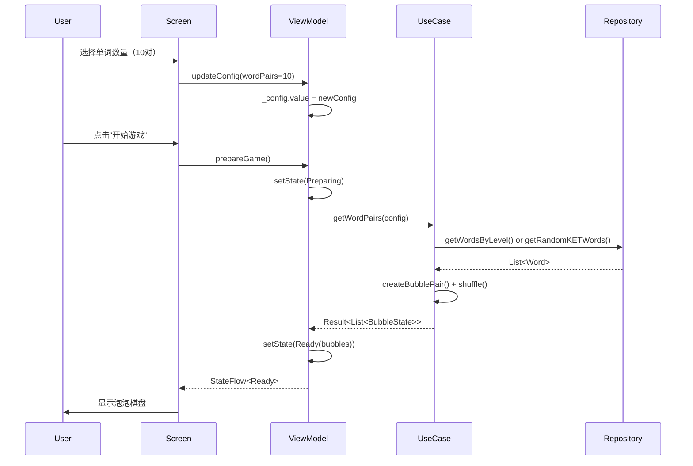
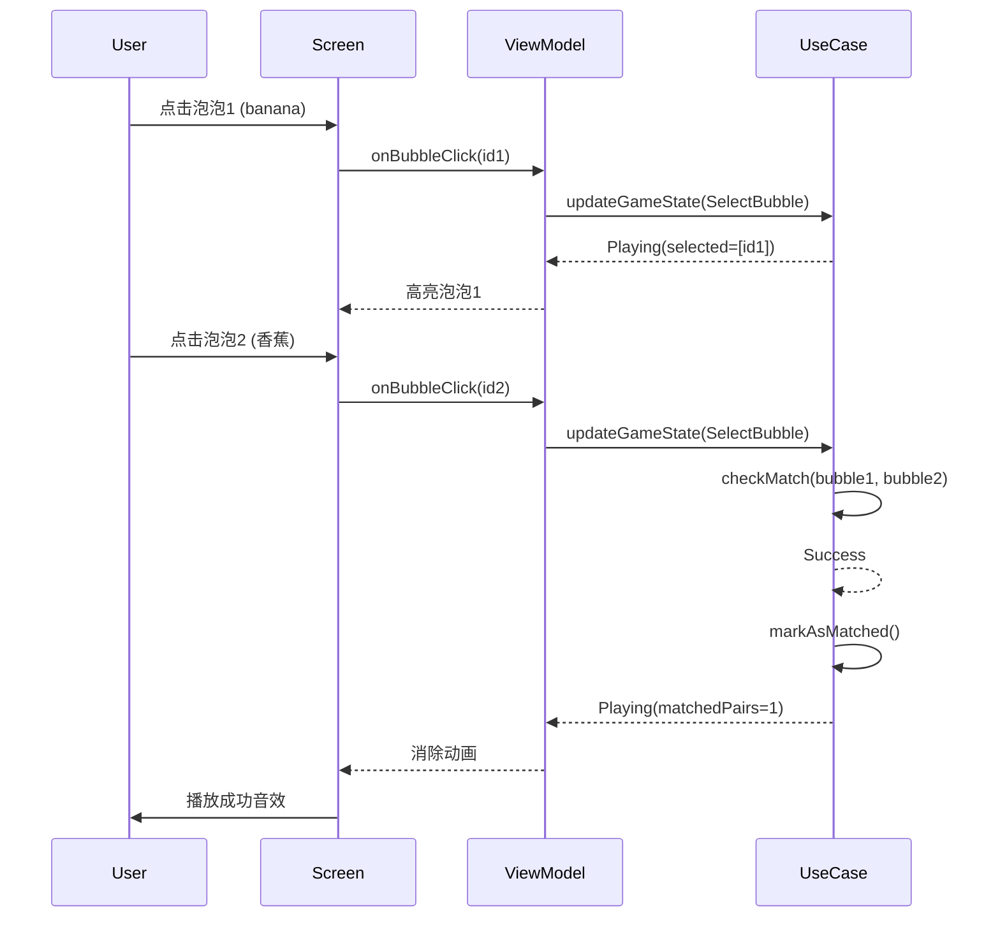
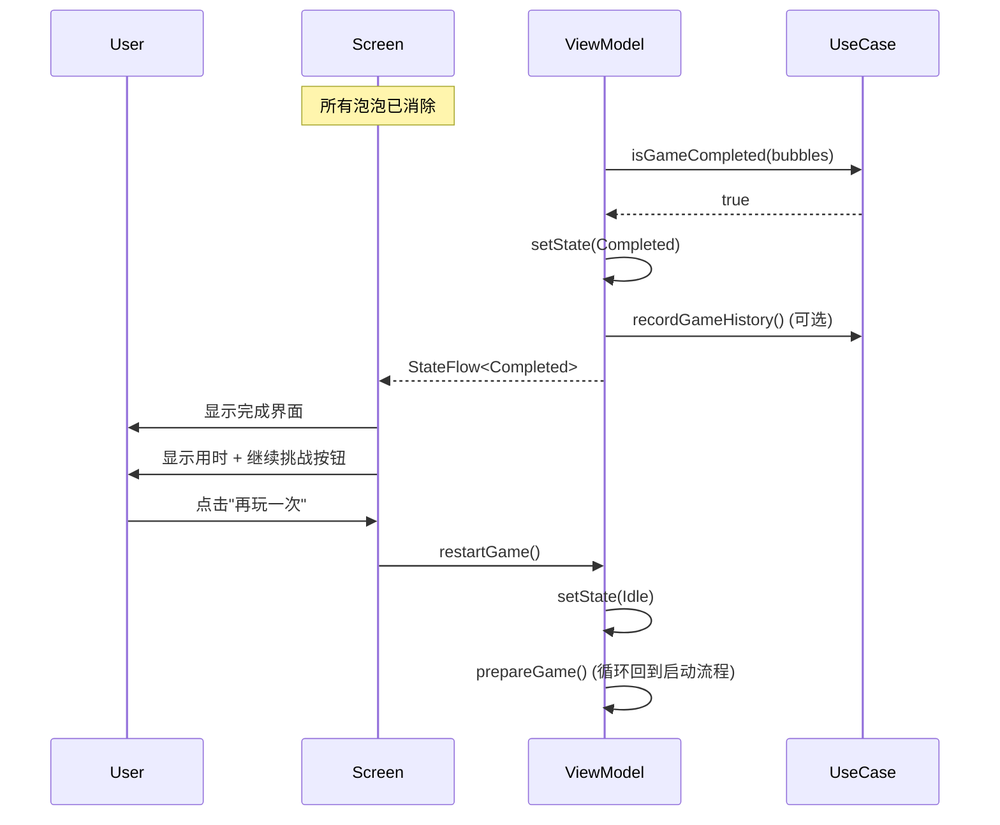

# 单词消消乐 - 架构设计产出文档

**Epic**: #9
**任务**: #6 - 设计游戏逻辑和状态机
**角色**: android-architect
**日期**: 2026-02-25
**状态**: ✅ 完成

---

## 📋 执行摘要

本文档提供了单词消消乐游戏模式的完整架构设计，包括数据模型定义、UseCase接口设计、Repository设计和Clean Architecture分层集成方案。

**设计原则**:
- 遵循Clean Architecture（UI → Domain → Data）
- 复用现有Repository（WordRepository）
- 最小化新增代码，最大化代码复用
- 与现有Hint系统和Score系统集成

---

## 1. 数据模型定义

### 1.1 泡泡状态 (BubbleState)

**位置**: `app/src/main/java/com/wordland/domain/model/BubbleState.kt`

```kotlin
package com.wordland.domain.model

import androidx.compose.runtime.Immutable
import kotlinx.serialization.Serializable

/**
 * 泡泡颜色枚举
 * 定义6种固定背景色
 */
@Serializable
enum class BubbleColor(val colorValue: ULong) {
    PINK(0xFFFFB6C1u),     // 粉色
    GREEN(0xFF90EE90u),    // 绿色
    PURPLE(0xFFDDA0DDu),   // 紫色
    ORANGE(0xFFFFA500u),   // 橙色
    BROWN(0xFFD2691Eu),    // 棕色
    BLUE(0xFF87CEEBu);     // 蓝色

    companion object {
        /**
         * 获取随机颜色
         */
        fun random(): BubbleColor = entries.random()

        /**
         * 根据索引分配颜色（确保配对的颜色不同）
         */
        fun assignByIndex(index: Int): BubbleColor {
            return entries[index % entries.size]
        }
    }
}

/**
 * 泡泡状态
 * 表示游戏中的一个单词泡泡（英文或中文）
 *
 * @property id 唯一标识符（格式：pair_{wordId}_en 或 pair_{wordId}_zh）
 * @property word 显示的文字（英文单词或中文翻译）
 * @property pairId 配对ID（同一对单词共享相同的pairId）
 * @property isSelected 是否被用户选中（当前回合）
 * @property isMatched 是否已配对消除
 * @property color 背景颜色
 */
@Immutable
@Serializable
data class BubbleState(
    val id: String,
    val word: String,
    val pairId: String,
    val isSelected: Boolean = false,
    val isMatched: Boolean = false,
    val color: BubbleColor = BubbleColor.random()
) {
    /**
     * 检查是否可以与另一个泡泡配对
     * 条件：
     * 1. 两个泡泡都未匹配
     * 2. 两个泡泡的pairId相同
     * 3. 不是同一个泡泡
     *
     * @param other 另一个泡泡
     * @return 是否可以配对
     */
    fun canMatchWith(other: BubbleState): Boolean {
        return !isMatched &&
               !other.isMatched &&
               pairId == other.pairId &&
               id != other.id
    }

    /**
     * 创建选中状态的副本
     */
    fun select(): BubbleState = copy(isSelected = true)

    /**
     * 创建取消选中状态的副本
     */
    fun deselect(): BubbleState = copy(isSelected = false)

    /**
     * 创建已匹配状态的副本
     */
    fun markAsMatched(): BubbleState = copy(isMatched = true, isSelected = false)
}
```

### 1.2 游戏状态 (MatchGameState)

**位置**: `app/src/main/java/com/wordland/domain/model/MatchGameState.kt`

```kotlin
package com.wordland.domain.model

import androidx.compose.runtime.Immutable
import androidx.compose.runtime.Stable
import kotlinx.serialization.Serializable

/**
 * 游戏状态（Sealed Class）
 * 定义游戏生命周期中的所有状态
 */
@Stable
@Serializable
sealed class MatchGameState {
    /**
     * 初始状态
     * 显示配置界面，用户可以选择单词数量
     */
    @Immutable
    @Serializable
    data object Idle : MatchGameState()

    /**
     * 准备中
     * 正在加载单词数据，生成泡泡
     */
    @Immutable
    @Serializable
    data object Preparing : MatchGameState()

    /**
     * 准备就绪
     * 泡泡已生成，等待用户开始游戏
     *
     * @property pairs 配对数量
     * @property bubbles 泡泡列表（已打乱）
     */
    @Immutable
    @Serializable
    data class Ready(
        val pairs: Int,
        val bubbles: List<BubbleState>
    ) : MatchGameState()

    /**
     * 游戏进行中
     * 用户可以点击泡泡进行配对
     *
     * @property bubbles 当前泡泡列表（状态实时更新）
     * @property selectedBubbles 已选中的泡泡ID列表（最多2个）
     * @property matchedPairs 已配对数量
     * @property elapsedTime 已用时间（毫秒）
     * @property startTime 游戏开始时间（用于计算暂停时长）
     */
    @Immutable
    @Serializable
    data class Playing(
        val bubbles: List<BubbleState>,
        val selectedBubbles: List<String> = emptyList(),
        val matchedPairs: Int = 0,
        val elapsedTime: Long = 0L,
        val startTime: Long = System.currentTimeMillis()
    ) : MatchGameState() {
        /**
         * 计算配对进度百分比
         */
        val progress: Float
            get() = if (bubbles.isEmpty()) 0f else matchedPairs.toFloat() / (bubbles.size / 2)

        /**
         * 检查游戏是否完成
         */
        val isCompleted: Boolean
            get() = bubbles.all { it.isMatched }
    }

    /**
     * 暂停状态
     * 用户点击暂停，计时器停止
     *
     * @property previousState 暂停前的Playing状态
     */
    @Immutable
    @Serializable
    data class Paused(
        val previousState: Playing
    ) : MatchGameState()

    /**
     * 完成状态
     * 所有泡泡已配对消除
     *
     * @property elapsedTime 总用时（毫秒）
     * @property pairs 总配对数
     * @property accuracy 准确率（可选，用于高级评分）
     */
    @Immutable
    @Serializable
    data class Completed(
        val elapsedTime: Long,
        val pairs: Int,
        val accuracy: Float = 1.0f
    ) : MatchGameState()

    /**
     * 游戏结束
     * 用户主动退出或发生错误
     */
    @Immutable
    @Serializable
    data object GameOver : MatchGameState()

    /**
     * 错误状态
     * 用于显示错误信息
     *
     * @property message 错误消息
     */
    @Immutable
    @Serializable
    data class Error(val message: String) : MatchGameState()
}
```

### 1.3 游戏配置 (MatchGameConfig)

**位置**: `app/src/main/java/com/wordland/domain/model/MatchGameConfig.kt`

```kotlin
package com.wordland.domain.model

import androidx.compose.runtime.Immutable
import androidx.compose.ui.unit.Dp
import androidx.compose.ui.unit.dp
import kotlinx.serialization.Serializable
import kotlin.math.max
import kotlin.math.min

/**
 * 游戏配置
 * 定义单词消消乐的游戏参数
 *
 * @property wordPairs 单词对数量（5-50）
 * @property bubbleSize 泡泡大小（dp）
 * @property columns 列数（固定6列）
 * @property enableTimer 是否启用计时器
 * @property enableSound 是否启用音效
 * @property enableAnimation 是否启用动画
 * @property islandId 岛屿ID（可选，用于限定单词范围）
 * @property levelId 关卡ID（可选，用于限定单词范围）
 */
@Immutable
@Serializable
data class MatchGameConfig(
    val wordPairs: Int = 10,
    val bubbleSize: Dp = 80.dp,
    val columns: Int = 6,
    val enableTimer: Boolean = true,
    val enableSound: Boolean = true,
    val enableAnimation: Boolean = true,
    val islandId: String? = null,
    val levelId: String? = null
) {
    init {
        require(wordPairs in MIN_PAIRS..MAX_PAIRS) {
            "wordPairs must be between $MIN_PAIRS and $MAX_PAIRS, but was $wordPairs"
        }
        require(columns > 0) { "columns must be positive" }
        require(bubbleSize.value > 0) { "bubbleSize must be positive" }
    }

    /**
     * 计算总泡泡数
     */
    val totalBubbles: Int
        get() = wordPairs * 2

    /**
     * 计算行数（向上取整）
     */
    val rows: Int
        get() = (totalBubbles + columns - 1) / columns

    /**
     * 计算预计高度（用于LazyVerticalGrid）
     */
    val estimatedHeight: Dp
        get() = bubbleSize * rows

    companion object {
        const val MIN_PAIRS = 5
        const val MAX_PAIRS = 50
        const val DEFAULT_PAIRS = 10
        const val DEFAULT_COLUMNS = 6

        /**
         * 创建默认配置
         */
        fun default() = MatchGameConfig()

        /**
         * 创建简单模式配置（5对单词）
         */
        fun easy() = MatchGameConfig(wordPairs = 5)

        /**
         * 创建困难模式配置（30对单词）
         */
        fun hard() = MatchGameConfig(wordPairs = 30)

        /**
         * 创建极限模式配置（50对单词）
         */
        fun extreme() = MatchGameConfig(wordPairs = 50)

        /**
         * 限制单词对数量在有效范围内
         */
        fun clampPairs(pairs: Int): Int {
            return max(MIN_PAIRS, min(MAX_PAIRS, pairs))
        }
    }
}
```

### 1.4 配对结果 (MatchResult)

**位置**: `app/src/main/java/com/wordland/domain/model/MatchResult.kt`

```kotlin
package com.wordland.domain.model

import androidx.compose.runtime.Immutable

/**
 * 配对结果
 * 表示两次点击泡泡后的配对检查结果
 */
@Immutable
sealed class MatchResult {
    /**
     * 匹配成功
     * 两个泡泡的pairId相同，可以消除
     */
    @Immutable
    data object Success : MatchResult()

    /**
     * 匹配失败
     * 两个泡泡的pairId不同
     */
    @Immutable
    data object Failed : MatchResult()

    /**
     * 无效操作
     * 可能的原因：
     * - 点击了同一个泡泡
     * - 点击了已匹配的泡泡
     * - 只点击了一个泡泡
     */
    @Immutable
    data object Invalid : MatchResult()

    /**
     * 等待第二次点击
     * 只点击了一个泡泡，等待用户点击第二个
     *
     * @property selectedBubbleId 已选中的泡泡ID
     */
    @Immutable
    data class WaitingForSecond(val selectedBubbleId: String) : MatchResult()
}
```

### 1.5 游戏动作 (GameAction)

**位置**: `app/src/main/java/com/wordland/domain/model/GameAction.kt`

```kotlin
package com.wordland.domain.model

import androidx.compose.runtime.Immutable

/**
 * 游戏动作
 * 定义用户可以执行的游戏操作
 */
@Immutable
sealed class GameAction {
    /**
     * 选择泡泡
     * @property bubbleId 泡泡ID
     */
    @Immutable
    data class SelectBubble(val bubbleId: String) : GameAction()

    /**
     * 开始游戏
     */
    @Immutable
    data object StartGame : GameAction()

    /**
     * 暂停游戏
     */
    @Immutable
    data object PauseGame : GameAction()

    /**
     * 继续游戏
     */
    @Immutable
    data object ResumeGame : GameAction()

    /**
     * 退出游戏
     */
    @Immutable
    data object ExitGame : GameAction()

    /**
     * 重置游戏
     */
    @Immutable
    data object ResetGame : GameAction()

    /**
     * 重新开始（使用相同配置）
     */
    @Immutable
    data object RestartGame : GameAction()
}
```

---

## 2. UseCase接口设计

### 2.1 GetWordPairsUseCase

**位置**: `app/src/main/java/com/wordland/domain/usecase/usecases/GetWordPairsUseCase.kt`

**职责**: 根据配置获取单词对并生成打乱的泡泡列表

```kotlin
package com.wordland.domain.usecase.usecases

import com.wordland.data.repository.WordRepository
import com.wordland.domain.model.BubbleState
import com.wordland.domain.model.MatchGameConfig
import com.wordland.domain.model.Result
import com.wordland.domain.model.Word
import javax.inject.Inject

/**
 * 获取单词对UseCase
 *
 * 职责：
 * 1. 从WordRepository获取单词
 * 2. 根据配置选择指定数量的单词对
 * 3. 为每个单词生成英文和中文泡泡
 * 4. 打乱泡泡顺序
 * 5. 返回泡泡列表
 *
 * 依赖：
 * - WordRepository（复用现有）
 */
class GetWordPairsUseCase
    @Inject
    constructor(
        private val wordRepository: WordRepository,
    ) {
        /**
         * 获取单词对并生成泡泡列表
         *
         * @param config 游戏配置
         * @return Result包含打乱后的泡泡列表
         */
        suspend operator fun invoke(config: MatchGameConfig): Result<List<BubbleState>> {
            return try {
                // 1. 获取单词列表
                val words = getWords(config)

                // 2. 检查是否有足够的单词
                if (words.size < config.wordPairs) {
                    return Result.Error(
                        IllegalStateException(
                            "Not enough words. Required: ${config.wordPairs}, Available: ${words.size}"
                        )
                    )
                }

                // 3. 随机选择N对单词
                val selectedWords = words.shuffled().take(config.wordPairs)

                // 4. 生成泡泡（每个单词生成2个泡泡：英文+中文）
                val bubbles = selectedWords.flatMap { word ->
                    createBubblePair(word)
                }

                // 5. 打乱泡泡顺序
                val shuffledBubbles = bubbles.shuffled()

                Result.Success(shuffledBubbles)
            } catch (e: Exception) {
                Result.Error(e)
            }
        }

        /**
         * 根据配置获取单词列表
         */
        private suspend fun getWords(config: MatchGameConfig): List<Word> {
            return when {
                // 如果指定了关卡ID，获取关卡的单词
                config.levelId != null -> {
                    wordRepository.getWordsByLevel(config.levelId)
                }
                // 如果指定了岛屿ID，获取岛屿的单词
                config.islandId != null -> {
                    wordRepository.getWordsByIsland(config.islandId)
                }
                // 否则获取所有KET单词
                else -> {
                    wordRepository.getRandomKETWords(Int.MAX_VALUE)
                }
            }
        }

        /**
         * 为一个单词创建一对泡泡（英文+中文）
         */
        private fun createBubblePair(word: Word): List<BubbleState> {
            val pairId = "pair_${word.id}"

            return listOf(
                // 英文泡泡
                BubbleState(
                    id = "${pairId}_en",
                    word = word.word,
                    pairId = pairId,
                    color = BubbleColor.random()
                ),
                // 中文泡泡
                BubbleState(
                    id = "${pairId}_zh",
                    word = word.translation,
                    pairId = pairId,
                    color = BubbleColor.random()
                )
            )
        }
    }
```

### 2.2 CheckMatchUseCase

**位置**: `app/src/main/java/com/wordland/domain/usecase/usecases/CheckMatchUseCase.kt`

**职责**: 检查两个选中的泡泡是否匹配

```kotlin
package com.wordland.domain.usecase.usecases

import com.wordland.domain.model.BubbleState
import com.wordland.domain.model.MatchResult
import javax.inject.Inject
import javax.inject.Singleton

/**
 * 检查配对UseCase
 *
 * 职责：
 * 1. 验证选中的泡泡是否有效
 * 2. 检查两个泡泡是否匹配
 * 3. 返回配对结果
 *
 * 依赖：
 * - 无（纯逻辑处理）
 */
@Singleton
class CheckMatchUseCase
    @Inject
    constructor() {
        /**
         * 检查两个泡泡是否匹配
         *
         * @param first 第一个选中的泡泡（可能为null）
         * @param second 第二个选中的泡泡（可能为null）
         * @return MatchResult
         */
        operator fun invoke(
            first: BubbleState?,
            second: BubbleState?
        ): MatchResult {
            // 1. 两个都为空 → 无效
            if (first == null || second == null) {
                return MatchResult.Invalid
            }

            // 2. 点击同一个泡泡 → 无效
            if (first.id == second.id) {
                return MatchResult.Invalid
            }

            // 3. 任一已匹配 → 无效
            if (first.isMatched || second.isMatched) {
                return MatchResult.Invalid
            }

            // 4. pairId相同 → 匹配成功
            return if (first.pairId == second.pairId) {
                MatchResult.Success
            } else {
                MatchResult.Failed
            }
        }

        /**
         * 检查单个泡泡点击是否有效
         * 用于处理第一次点击
         *
         * @param bubble 泡泡（可能为null）
         * @return 是否可以点击
         */
        fun canSelectBubble(bubble: BubbleState?): Boolean {
            return bubble != null && !bubble.isMatched && !bubble.isSelected
        }

        /**
         * 检查游戏是否完成
         *
         * @param bubbles 所有泡泡
         * @return 是否全部匹配
         */
        fun isGameCompleted(bubbles: List<BubbleState>): Boolean {
            return bubbles.all { it.isMatched }
        }
    }
```

### 2.3 UpdateGameStateUseCase

**位置**: `app/src/main/java/com/wordland/domain/usecase/usecases/UpdateGameStateUseCase.kt`

**职责**: 根据用户操作更新游戏状态

```kotlin
package com.wordland.domain.usecase.usecases

import com.wordland.domain.model.BubbleState
import com.wordland.domain.model.GameAction
import com.wordland.domain.model.MatchGameState
import com.wordland.domain.model.MatchResult
import javax.inject.Inject
import javax.inject.Singleton
import kotlin.system.currentTimeMillis

/**
 * 更新游戏状态UseCase
 *
 * 职责：
 * 1. 根据GameAction更新MatchGameState
 * 2. 处理状态转换逻辑
 * 3. 管理计时器
 * 4. 检查游戏完成条件
 *
 * 依赖：
 * - CheckMatchUseCase（用于检查配对）
 */
@Singleton
class UpdateGameStateUseCase
    @Inject
    constructor(
        private val checkMatchUseCase: CheckMatchUseCase,
    ) {
        /**
         * 更新游戏状态
         *
         * @param currentState 当前状态
         * @param action 用户操作
         * @param checkMatchResult 配对检查结果（如果需要）
         * @return 新的游戏状态
         */
        operator fun invoke(
            currentState: MatchGameState,
            action: GameAction,
            checkMatchResult: MatchResult? = null
        ): MatchGameState {
            return when (action) {
                is GameAction.StartGame -> handleStartGame(currentState)
                is GameAction.SelectBubble -> handleSelectBubble(currentState, action.bubbleId)
                is GameAction.PauseGame -> handlePauseGame(currentState)
                is GameAction.ResumeGame -> handleResumeGame(currentState)
                is GameAction.ExitGame -> MatchGameState.GameOver
                is GameAction.ResetGame -> MatchGameState.Idle
                is GameAction.RestartGame -> handleRestartGame(currentState)
            }
        }

        /**
         * 处理开始游戏
         */
        private fun handleStartGame(currentState: MatchGameState): MatchGameState {
            return when (currentState) {
                is MatchGameState.Ready -> {
                    MatchGameState.Playing(
                        bubbles = currentState.bubbles,
                        selectedBubbles = emptyList(),
                        matchedPairs = 0,
                        elapsedTime = 0L,
                        startTime = currentTimeMillis()
                    )
                }
                else -> currentState // 状态错误，保持不变
            }
        }

        /**
         * 处理选择泡泡
         */
        private fun handleSelectBubble(
            currentState: MatchGameState,
            bubbleId: String
        ): MatchGameState {
            if (currentState !is MatchGameState.Playing) {
                return currentState
            }

            val bubbles = currentState.bubbles
            val clickedBubble = bubbles.find { it.id == bubbleId }

            // 检查是否可以点击
            if (!checkMatchUseCase.canSelectBubble(clickedBubble)) {
                return currentState
            }

            val selectedBubbles = currentState.selectedBubbles.toMutableList()

            // 如果已经选中了这个泡泡，取消选中
            if (selectedBubbles.contains(bubbleId)) {
                selectedBubbles.remove(bubbleId)
                return currentState.copy(
                    bubbles = bubbles.map { bubble ->
                        if (bubble.id == bubbleId) bubble.deselect() else bubble
                    },
                    selectedBubbles = selectedBubbles
                )
            }

            // 选中泡泡
            selectedBubbles.add(bubbleId)

            // 如果选中了2个泡泡，检查配对
            return if (selectedBubbles.size == 2) {
                checkMatchAndUpdate(currentState, selectedBubbles)
            } else {
                // 只选中了1个泡泡，更新状态
                currentState.copy(
                    bubbles = bubbles.map { bubble ->
                        if (bubble.id == bubbleId) bubble.select() else bubble
                    },
                    selectedBubbles = selectedBubbles
                )
            }
        }

        /**
         * 检查配对并更新状态
         */
        private fun checkMatchAndUpdate(
            currentState: MatchGameState.Playing,
            selectedBubbles: List<String>
        ): MatchGameState {
            val bubbles = currentState.bubbles
            val first = bubbles.find { it.id == selectedBubbles[0] }
            val second = bubbles.find { it.id == selectedBubbles[1] }

            val matchResult = checkMatchUseCase(first, second)

            return when (matchResult) {
                is MatchResult.Success -> {
                    // 配对成功：标记泡泡为已匹配
                    val updatedBubbles = bubbles.map { bubble ->
                        when (bubble.id) {
                            first?.id, second?.id -> bubble.markAsMatched()
                            else -> bubble.deselect()
                        }
                    }

                    val newMatchedPairs = currentState.matchedPairs + 1

                    // 检查游戏是否完成
                    if (checkMatchUseCase.isGameCompleted(updatedBubbles)) {
                        MatchGameState.Completed(
                            elapsedTime = currentState.elapsedTime,
                            pairs = currentState.bubbles.size / 2
                        )
                    } else {
                        currentState.copy(
                            bubbles = updatedBubbles,
                            selectedBubbles = emptyList(),
                            matchedPairs = newMatchedPairs
                        )
                    }
                }
                is MatchResult.Failed -> {
                    // 配对失败：取消选中（UI会显示错误动画）
                    currentState.copy(
                        bubbles = bubbles.map { it.deselect() },
                        selectedBubbles = emptyList()
                    )
                }
                else -> {
                    // 其他情况：取消选中
                    currentState.copy(
                        bubbles = bubbles.map { it.deselect() },
                        selectedBubbles = emptyList()
                    )
                }
            }
        }

        /**
         * 处理暂停游戏
         */
        private fun handlePauseGame(currentState: MatchGameState): MatchGameState {
            return when (currentState) {
                is MatchGameState.Playing -> {
                    // 更新elapsedTime，保存当前时间
                    val updatedState = currentState.copy(
                        elapsedTime = currentState.elapsedTime + (currentTimeMillis() - currentState.startTime)
                    )
                    MatchGameState.Paused(previousState = updatedState)
                }
                else -> currentState
            }
        }

        /**
         * 处理继续游戏
         */
        private fun handleResumeGame(currentState: MatchGameState): MatchGameState {
            return when (currentState) {
                is MatchGameState.Paused -> {
                    // 恢复Playing状态，重置startTime
                    currentState.previousState.copy(
                        startTime = currentTimeMillis()
                    )
                }
                else -> currentState
            }
        }

        /**
         * 处理重新开始
         */
        private fun handleRestartGame(currentState: MatchGameState): MatchGameState {
            return when (currentState) {
                is MatchGameState.Ready, is MatchGameState.Playing, is MatchGameState.Paused -> {
                    // 重新开始需要重新准备泡泡，这里返回Idle状态
                    // 由ViewModel调用prepareGame()重新准备
                    MatchGameState.Idle
                }
                else -> currentState
            }
        }
    }
```

### 2.4 RecordMatchGameHistoryUseCase（可选）

**位置**: `app/src/main/java/com/wordland/domain/usecase/usecases/RecordMatchGameHistoryUseCase.kt`

**职责**: 记录游戏历史（如果需要统计功能）

```kotlin
package com.wordland.domain.usecase.usecases

import com.wordland.data.repository.GameHistoryRepository
import com.wordland.domain.model.MatchGameState
import com.wordland.domain.model.Result
import com.wordland.domain.model.statistics.GameHistory
import com.wordland.domain.model.statistics.GameMode
import com.wordland.domain.model.statistics.GameType
import javax.inject.Inject

/**
 * 记录单词消消乐游戏历史UseCase
 *
 * 职责：
 * 1. 记录游戏结果
 * 2. 保存统计数据
 * 3. 更新成就系统（可选）
 *
 * 依赖：
 * - GameHistoryRepository（复用现有）
 */
class RecordMatchGameHistoryUseCase
    @Inject
    constructor(
        private val gameHistoryRepository: GameHistoryRepository,
    ) {
        /**
         * 记录游戏历史
         *
         * @param userId 用户ID
         * @param gameState 游戏状态
         * @return Result
         */
        suspend operator fun invoke(
            userId: String,
            gameState: MatchGameState.Completed
        ): Result<Unit> {
            return try {
                val gameHistory = GameHistory(
                    userId = userId,
                    gameMode = GameMode.WORD_MATCH,
                    gameType = GameType.PRACTICE,
                    score = calculateScore(gameState),
                    duration = gameState.elapsedTime,
                    completedAt = System.currentTimeMillis(),
                    // 其他字段...
                )

                gameHistoryRepository.insertGameHistory(gameHistory)
                Result.Success(Unit)
            } catch (e: Exception) {
                Result.Error(e)
            }
        }

        /**
         * 计算得分
         */
        private fun calculateScore(gameState: MatchGameState.Completed): Int {
            // 简单的得分公式：基于配对数和用时
            val baseScore = gameState.pairs * 100
            val timeBonus = maxOf(0, (300000 - gameState.elapsedTime) / 1000) // 5分钟内完成有额外分
            return baseScore + timeBonus.toInt()
        }
    }
```

---

## 3. Repository设计

### 3.1 决策：复用现有Repository

**结论**: 不需要创建新的Repository接口，直接复用现有的`WordRepository`。

**理由**:
1. `WordRepository`已提供所需的所有数据获取方法：
   - `getWordsByLevel(levelId)` - 获取关卡单词
   - `getWordsByIsland(islandId)` - 获取岛屿单词
   - `getRandomKETWords(limit)` - 获取随机单词
2. 单词消消乐不需要持久化新的数据类型
3. 游戏历史可以复用现有的`GameHistoryRepository`

**方案**: 在`GetWordPairsUseCase`中直接注入`WordRepository`。

### 3.2 扩展方案（未来需求）

如果未来需要持久化单词消消乐的专用数据（如自定义词表），可以创建：

```kotlin
// 可选：未来的扩展接口
interface MatchGameRepository {
    /**
     * 保存自定义词表
     */
    suspend fun saveCustomWordList(userId: String, words: List<Word>): Result<Unit>

    /**
     * 获取用户的自定义词表
     */
    suspend fun getCustomWordLists(userId: String): Result<List<CustomWordList>>

    /**
     * 删除自定义词表
     */
    suspend fun deleteCustomWordList(listId: String): Result<Unit>
}

/**
 * 自定义词表
 */
data class CustomWordList(
    val id: String,
    val userId: String,
    val name: String,
    val words: List<Word>,
    val createdAt: Long
)
```

**注意**: Epic #9的MVP阶段不需要此功能，暂不实现。

---

## 4. Clean Architecture集成方案

### 4.1 分层架构图

```
┌─────────────────────────────────────────────────────────┐
│                      UI Layer                           │
│  ┌───────────────────────────────────────────────────┐  │
│  │  MatchGameScreen.kt                               │  │
│  │  - MatchGameConfigUI (配置界面)                   │  │
│  │  - BubbleGrid (泡泡棋盘)                          │  │
│  │  - MatchGameViewModel                             │  │
│  └───────────────────────────────────────────────────┘  │
└─────────────────────────────────────────────────────────┘
                          ↓ calls
┌─────────────────────────────────────────────────────────┐
│                   Domain Layer                          │
│  ┌───────────────────────────────────────────────────┐  │
│  │  Model (domain/model/)                            │  │
│  │  - BubbleState.kt                                 │  │
│  │  - MatchGameState.kt                              │  │
│  │  - MatchGameConfig.kt                             │  │
│  │  - MatchResult.kt                                 │  │
│  │  - GameAction.kt                                  │  │
│  └───────────────────────────────────────────────────┘  │
│  ┌───────────────────────────────────────────────────┐  │
│  │  UseCase (domain/usecase/usecases/)               │  │
│  │  - GetWordPairsUseCase                            │  │
│  │  - CheckMatchUseCase                              │  │
│  │  - UpdateGameStateUseCase                         │  │
│  │  - RecordMatchGameHistoryUseCase (可选)          │  │
│  └───────────────────────────────────────────────────┘  │
└─────────────────────────────────────────────────────────┘
                          ↓ calls
┌─────────────────────────────────────────────────────────┐
│                    Data Layer                           │
│  ┌───────────────────────────────────────────────────┐  │
│  │  Repository (复用现有)                             │  │
│  │  - WordRepository.kt                              │  │
│  │  - GameHistoryRepository.kt (可选)                │  │
│  └───────────────────────────────────────────────────┘  │
│  ┌───────────────────────────────────────────────────┐  │
│  │  DAO (复用现有)                                    │  │
│  │  - WordDao.kt                                     │  │
│  │  - GameHistoryDao.kt (可选)                       │  │
│  └───────────────────────────────────────────────────┘  │
└─────────────────────────────────────────────────────────┘
```

### 4.2 Domain层新增内容

**位置**: `app/src/main/java/com/wordland/domain/`

```
domain/
├── model/
│   ├── BubbleState.kt          ✨ 新增
│   ├── MatchGameState.kt       ✨ 新增
│   ├── MatchGameConfig.kt      ✨ 新增
│   ├── MatchResult.kt          ✨ 新增
│   └── GameAction.kt           ✨ 新增
├── usecase/
│   └── usecases/
│       ├── GetWordPairsUseCase.kt          ✨ 新增
│       ├── CheckMatchUseCase.kt            ✨ 新增
│       ├── UpdateGameStateUseCase.kt       ✨ 新增
│       └── RecordMatchGameHistoryUseCase.kt  ⚠️ 可选
└── algorithm/
    └── MatchGameScoringAlgorithm.kt  ⚠️ 可选（高级评分）
```

### 4.3 Data层变更

**位置**: `app/src/main/java/com/wordland/data/`

```
data/
└── repository/
    ├── WordRepository.kt           ✅ 复用（无变更）
    └── GameHistoryRepository.kt    ✅ 复用（可选扩展）
```

**说明**: Data层不需要新增任何文件，直接复用现有Repository。

### 4.4 UI层新增内容

**位置**: `app/src/main/java/com/wordland/ui/`

```
ui/
├── screens/
│   └── MatchGameScreen.kt         ✨ 新增
├── viewmodel/
│   └── MatchGameViewModel.kt      ✨ 新增
├── uistate/
│   └── MatchGameUiState.kt        ⚠️ 可选（或直接使用MatchGameState）
└── components/
    ├── BubbleTile.kt              ✨ 新增
    ├── MatchGameConfigUI.kt       ✨ 新增
    └── BubbleGrid.kt              ✨ 新增
```

### 4.5 DI集成

**位置**: `di/AppServiceLocator.kt`

在现有的Service Locator中添加：

```kotlin
// AppServiceLocator.kt

// 添加MatchGameViewModel的工厂方法
fun provideMatchGameViewModelFactory(): MatchGameViewModelFactory {
    return MatchGameViewModelFactory(
        getWordPairsUseCase = provideGetWordPairsUseCase(),
        checkMatchUseCase = provideCheckMatchUseCase(),
        updateGameStateUseCase = provideUpdateGameStateUseCase(),
        recordMatchGameHistoryUseCase = provideRecordMatchGameHistoryUseCase()
    )
}

// UseCase提供方法
private fun provideGetWordPairsUseCase(): GetWordPairsUseCase {
    return GetWordPairsUseCase(wordRepository = wordRepository)
}

private fun provideCheckMatchUseCase(): CheckMatchUseCase {
    return CheckMatchUseCase()
}

private fun provideUpdateGameStateUseCase(): UpdateGameStateUseCase {
    return UpdateGameStateUseCase(
        checkMatchUseCase = provideCheckMatchUseCase()
    )
}

private fun provideRecordMatchGameHistoryUseCase(): RecordMatchGameHistoryUseCase {
    return RecordMatchGameHistoryUseCase(
        gameHistoryRepository = gameHistoryRepository
    )
}
```

### 4.6 导航集成

**位置**: `navigation/SetupNavGraph.kt`

在现有的导航图中添加路由：

```kotlin
// SetupNavGraph.kt

composable(
    route = "matchGame",
    arguments = listOf()
) { backStackEntry ->
    val viewModel: MatchGameViewModel = viewModel(
        factory = AppServiceLocator.provideMatchGameViewModelFactory()
    )
    MatchGameScreen(
        viewModel = viewModel,
        onNavigateBack = { navController.popBackStack() }
    )
}
```

### 4.7 HomeScreen集成

**位置**: `ui/screens/HomeScreen.kt`

在主页添加入口卡片：

```kotlin
// HomeScreen.kt

Card(
    modifier = Modifier
        .fillMaxWidth()
        .clickable { navController.navigate("matchGame") }
) {
    Row(
        modifier = Modifier.padding(16.dp),
        verticalAlignment = Alignment.CenterVertically
    ) {
        Text(
            text = "🎮",
            style = MaterialTheme.typography.headlineMedium
        )
        Spacer(modifier = Modifier.width(16.dp))
        Column {
            Text(
                text = "单词消消乐",
                style = MaterialTheme.typography.titleMedium
            )
            Text(
                text = "配对消除，趣味学习",
                style = MaterialTheme.typography.bodySmall,
                color = MaterialTheme.colorScheme.onSurfaceVariant
            )
        }
    }
}
```

---

## 5. 数据流图

### 5.1 游戏启动流程



### 5.2 配对流程



### 5.3 游戏完成流程



---

## 6. 接口集成检查清单

### 6.1 与现有系统集成

| 组件 | 集成方式 | 状态 | 说明 |
|------|----------|------|------|
| **WordRepository** | 直接复用 | ✅ | 无需修改 |
| **GameHistoryRepository** | 可选复用 | ⚠️ | 用于统计功能（MVP可选） |
| **HintSystem** | 不集成 | N/A | 单词消消乐不需要提示系统 |
| **StarRatingSystem** | 不集成 | N/A | 暂不使用星级评分 |
| **AchievementSystem** | 未来集成 | 📋 | Epic #9不包含成就 |
| **Navigation** | 添加路由 | ✅ | 在SetupNavGraph.kt中添加 |
| **ServiceLocator** | 添加工厂方法 | ✅ | 在AppServiceLocator.kt中添加 |
| **HomeScreen** | 添加入口卡片 | ✅ | 在HomeScreen.kt中添加 |

### 6.2 新增文件列表

**Domain层** (5个核心文件):
- ✅ `domain/model/BubbleState.kt`
- ✅ `domain/model/MatchGameState.kt`
- ✅ `domain/model/MatchGameConfig.kt`
- ✅ `domain/model/MatchResult.kt`
- ✅ `domain/model/GameAction.kt`

**UseCase层** (3个核心文件):
- ✅ `domain/usecase/usecases/GetWordPairsUseCase.kt`
- ✅ `domain/usecase/usecases/CheckMatchUseCase.kt`
- ✅ `domain/usecase/usecases/UpdateGameStateUseCase.kt`

**可选UseCase** (1个文件):
- ⚠️ `domain/usecase/usecases/RecordMatchGameHistoryUseCase.kt`

**UI层** (4-5个文件):
- ✅ `ui/screens/MatchGameScreen.kt`
- ✅ `ui/viewmodel/MatchGameViewModel.kt`
- ✅ `ui/components/BubbleTile.kt`
- ✅ `ui/components/BubbleGrid.kt`
- ✅ `ui/components/MatchGameConfigUI.kt`

**DI配置** (修改现有文件):
- ✅ `di/AppServiceLocator.kt` (添加工厂方法)
- ✅ `navigation/SetupNavGraph.kt` (添加路由)
- ✅ `ui/screens/HomeScreen.kt` (添加入口)

**总计**: 12-13个新增文件 + 3个修改文件

---

## 7. 技术风险与缓解措施

### 7.1 风险识别

| 风险 | 级别 | 影响 | 缓解措施 |
|------|------|------|----------|
| **性能问题** (100个泡泡渲染) | Medium | 帧率下降 | 使用LazyVerticalGrid，限制同时渲染 |
| **状态管理复杂度** | Low | 状态不同步 | 使用Sealed Class，单一状态源 |
| **Repository依赖** | Low | 获取不到单词 | 复用现有WordRepository，已验证 |
| **内存泄漏** | Low | 长时间游戏内存增长 | 使用Immutable数据类，避免持有Context |
| **动画性能** | Medium | 低端设备卡顿 | 使用Compose Animation API，限制并发动画 |

### 7.2 性能优化建议

**UI层优化**:
1. 使用`LazyVerticalGrid`而非`Column` + `Row`
2. 为泡泡设置固定的`key`，避免不必要的重组
3. 使用`derivedStateOf`计算派生状态
4. 限制同时播放的动画数量（最多2个）

**内存优化**:
1. 使用`@Immutable`注解标记数据类
2. 避免在Compose函数中创建新对象
3. 使用`remember`缓存计算结果

**测试验证**:
- 在低端设备上测试50对单词（100个泡泡）的渲染性能
- 使用Compose性能工具监控帧率
- 监控内存增长，确保无泄漏

---

## 8. 与其他游戏模式的对比

### 8.1 架构对比

| 特性 | Spell Battle (现有) | Word Match (新增) |
|------|---------------------|-------------------|
| **状态管理** | LearningUiState | MatchGameState |
| **UseCase数量** | 8+ | 3 (核心) |
| **Repository复用** | WordRepository | WordRepository ✅ |
| **提示系统** | ✅ 集成 | ❌ 不需要 |
| **星级评分** | ✅ 集成 | ⚠️ 可选（MVP不包含） |
| **游戏历史** | ✅ 集成 | ⚠️ 可选（MVP不包含） |

### 8.2 代码复用

**直接复用**:
- `WordRepository` - 数据获取
- `GameHistoryRepository` - 历史记录（可选）
- `Result<T>` - 结果封装
- `Navigation` - 导航框架
- `ServiceLocator` - DI容器

**不复用**:
- `HintSystem` - 单词消消乐不需要提示
- `StarRatingCalculator` - 暂不使用星级评分
- `SpellBattleQuestion` - 不同的游戏逻辑

---

## 9. 下一步行动

### 9.1 立即行动（任务 #7）

**任务**: 创建数据模型和UseCase

**文件清单**:
```
domain/model/
  - BubbleState.kt
  - MatchGameState.kt
  - MatchGameConfig.kt
  - MatchResult.kt
  - GameAction.kt

domain/usecase/usecases/
  - GetWordPairsUseCase.kt
  - CheckMatchUseCase.kt
  - UpdateGameStateUseCase.kt
```

### 9.2 后续任务

| 任务 | 负责角色 | 预计时间 | 产出 |
|------|----------|----------|------|
| 任务 #7 | android-engineer | 2-3h | 创建Domain层文件 |
| 任务 #8 | compose-ui-designer | 4-5h | 创建UI组件 |
| 任务 #9 | android-test-engineer | 2-3h | 编写单元测试 |
| 任务 #10 | android-engineer | 2-3h | 集成导航和DI |
| 任务 #11 | android-performance-expert | 1-2h | 性能优化验证 |
| 任务 #12 | android-test-engineer | 2-3h | 真机测试验证 |

---

## 10. 设计文档参考

### 10.1 输入文档

- `docs/requirements/09-word-match-game.md` - 需求文档
- `docs/planning/Epic9/GAME_LOGIC_DESIGN.md` - 游戏逻辑设计（任务#6产出）
- `CLAUDE.md` - 项目架构指南

### 10.2 参考文档

- `docs/analysis/HINT_SYSTEM_ANALYSIS.md` - 提示系统分析（参考UseCase设计）
- `app/src/main/java/com/wordland/domain/usecase/usecases/UseHintUseCaseEnhanced.kt` - UseCase示例
- `app/src/main/java/com/wordland/domain/model/Result.kt` - Result封装示例

---

## 11. 总结

### 11.1 架构设计亮点

1. **高度复用**: 复用现有`WordRepository`，无需新增数据层
2. **清晰分层**: 严格遵循Clean Architecture（UI → Domain → Data）
3. **轻量设计**: 只需3个核心UseCase，代码量小
4. **易于测试**: 纯Kotlin逻辑，无Android依赖
5. **性能优先**: 使用LazyVerticalGrid + Immutable数据类

### 11.2 关键决策

| 决策 | 理由 | 影响 |
|------|------|------|
| **不复用HintSystem** | 单词消消乐不需要提示 | 简化架构，减少依赖 |
| **不新增Repository** | WordRepository已满足需求 | 减少代码量，提高复用率 |
| **使用Sealed Class** | 类型安全，编译时检查 | 减少运行时错误 |
| **可选历史记录** | MVP阶段不强制统计功能 | 降低复杂度，快速迭代 |

### 11.3 预期产出

- **新增代码**: ~2000行（含注释和文档）
- **测试代码**: ~1000行（单元测试）
- **集成点**: 3个（ServiceLocator, Navigation, HomeScreen）
- **预计开发时间**: 16-20小时（Epic #9总计）

---

**文档版本**: 1.0
**作者**: android-architect
**状态**: ✅ 架构设计完成
**下一步**: 任务 #7 - 创建数据模型和UseCase（android-engineer）
