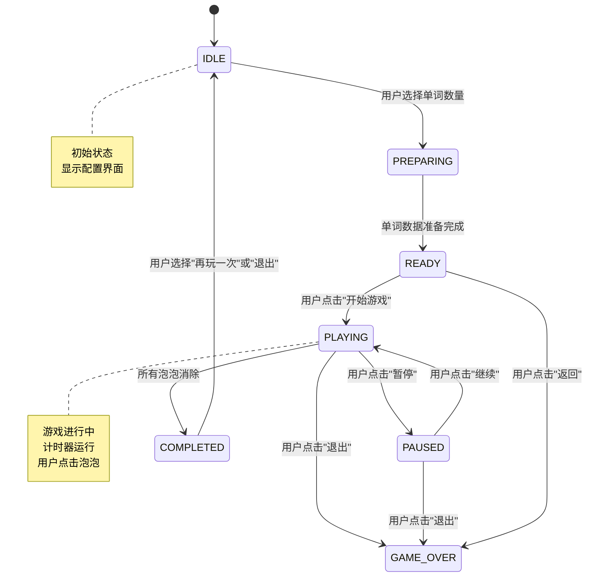
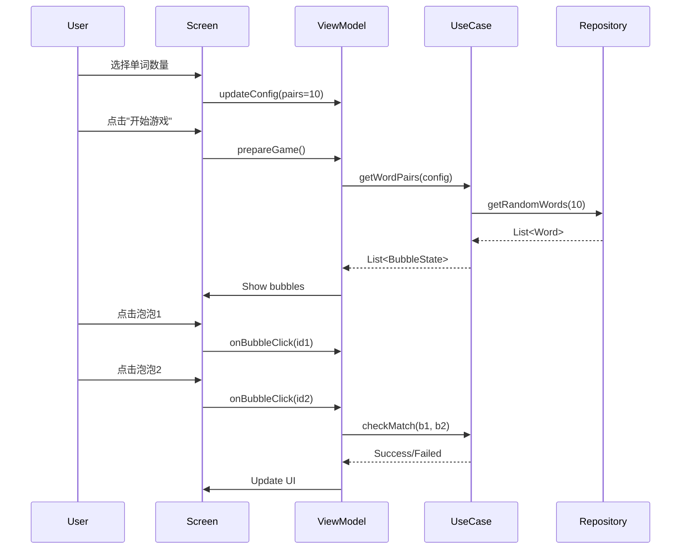

# 单词消消乐 - 游戏逻辑和架构设计

**Epic**: #9
**任务**: #6
**日期**: 2026-02-25
**状态**: 🔄 设计中

---

## 1. 游戏状态机设计

### 1.1 状态定义



### 1.2 状态详细说明

| 状态 | 描述 | 允许的操作 | 转换条件 |
|------|------|------------|----------|
| **IDLE** | 初始状态 | 选择单词数量 | 用户确认配置 |
| **PREPARING** | 准备单词数据 | 无 | 数据加载完成 |
| **READY** | 等待开始 | 开始游戏、返回 | 用户点击按钮 |
| **PLAYING** | 游戏进行中 | 点击泡泡、暂停 | 完成或退出 |
| **PAUSED** | 暂停状态 | 继续、退出 | 用户点击按钮 |
| **COMPLETED** | 完成状态 | 再玩一次、退出 | 用户选择 |
| **GAME_OVER** | 游戏结束 | 无 | N/A |

### 1.3 Kotlin实现（Sealed Class）

```kotlin
/**
 * 游戏状态
 */
sealed class MatchGameState {
    /**
     * 初始状态 - 显示配置界面
     */
    data object Idle : MatchGameState()

    /**
     * 准备中 - 加载单词数据
     */
    data object Preparing : MatchGameState()

    /**
     * 准备就绪 - 显示泡泡布局
     * @param pairs 配对数量
     * @param bubbles 泡泡列表
     */
    data class Ready(
        val pairs: Int,
        val bubbles: List<BubbleState>
    ) : MatchGameState()

    /**
     * 游戏进行中
     * @param elapsedTime 已用时间（毫秒）
     * @param selectedBubbles 已选中的泡泡ID列表
     * @param matchedPairs 已配对数量
     */
    data class Playing(
        val elapsedTime: Long,
        val selectedBubbles: List<String>,
        val matchedPairs: Int
    ) : MatchGameState()

    /**
     * 暂停状态
     */
    data object Paused : MatchGameState()

    /**
     * 完成状态
     * @param elapsedTime 总用时（毫秒）
     * @param pairs 总配对数
     */
    data class Completed(
        val elapsedTime: Long,
        val pairs: Int
    ) : MatchGameState()

    /**
     * 游戏结束
     */
    data object GameOver : MatchGameState()
}
```

---

## 2. 数据模型设计

### 2.1 泡泡状态

```kotlin
/**
 * 泡泡颜色
 */
enum class BubbleColor(val colorValue: ULong) {
    PINK(0xFFFFB6C1u),
    GREEN(0xFF90EE90u),
    PURPLE(0xFFDDA0DDu),
    ORANGE(0xFFFFA500u),
    BROWN(0xFFD2691Eu),
    BLUE(0xFF87CEEBu);

    companion object {
        fun random(): BubbleColor = entries.random()
    }
}

/**
 * 泡泡状态
 * @param id 唯一标识符
 * @param word 显示的文字（英文或中文）
 * @param pairId 配对ID（同一对单词有相同的pairId）
 * @param isSelected 是否被选中
 * @param isMatched 是否已配对消除
 * @param color 背景颜色
 */
data class BubbleState(
    val id: String,
    val word: String,
    val pairId: String,
    val isSelected: Boolean = false,
    val isMatched: Boolean = false,
    val color: BubbleColor = BubbleColor.random()
) {
    /**
     * 检查是否可以配对
     */
    fun canMatchWith(other: BubbleState): Boolean {
        return !isMatched &&
               !other.isMatched &&
               pairId == other.pairId &&
               id != other.id
    }
}
```

### 2.2 游戏配置

```kotlin
/**
 * 游戏配置
 * @param wordPairs 单词对数量（5-50）
 * @param bubbleSize 泡泡大小（dp）
 * @param columns 列数（固定6列）
 * @param enableTimer 是否启用计时器
 * @param enableSound 是否启用音效
 */
data class MatchGameConfig(
    val wordPairs: Int = 10,
    val bubbleSize: Dp = 80.dp,
    val columns: Int = 6,
    val enableTimer: Boolean = true,
    val enableSound: Boolean = true
) {
    init {
        require(wordPairs in 5..50) { "wordPairs must be between 5 and 50" }
    }

    /**
     * 计算总泡泡数
     */
    val totalBubbles: Int
        get() = wordPairs * 2
}
```

### 2.3 配对结果

```kotlin
/**
 * 配对结果
 */
sealed class MatchResult {
    /**
     * 匹配成功
     */
    data object Success : MatchResult()

    /**
     * 匹配失败
     */
    data object Failed : MatchResult()

    /**
     * 无效操作（点击同一个泡泡、已匹配的泡泡等）
     */
    data object Invalid : MatchResult()
}
```

---

## 3. 核心游戏逻辑

### 3.1 配对检查逻辑

```kotlin
/**
 * 检查两个泡泡是否匹配
 * @param first 第一个选中的泡泡
 * @param second 第二个选中的泡泡
 * @return MatchResult
 */
fun checkMatch(
    first: BubbleState?,
    second: BubbleState?
): MatchResult {
    // 两个都为空 → 无效
    if (first == null || second == null) {
        return MatchResult.Invalid
    }

    // 点击同一个泡泡 → 无效
    if (first.id == second.id) {
        return MatchResult.Invalid
    }

    // 任一已匹配 → 无效
    if (first.isMatched || second.isMatched) {
        return MatchResult.Invalid
    }

    // pairId相同 → 匹配成功
    return if (first.pairId == second.pairId) {
        MatchResult.Success
    } else {
        MatchResult.Failed
    }
}
```

### 3.2 单词选择和打乱算法

```kotlin
/**
 * 从词库中选择单词对并打乱
 * @param config 游戏配置
 * @param words 词库列表
 * @return 打乱后的泡泡列表
 */
suspend fun prepareBubbles(
    config: MatchGameConfig,
    words: List<Word>
): List<BubbleState> {
    // 1. 随机选择N对单词
    val selectedPairs = words
        .shuffled()
        .take(config.wordPairs)
        .map { word ->
            // 生成唯一的pairId
            val pairId = "pair_${word.id}"

            // 英文泡泡
            BubbleState(
                id = "${pairId}_en",
                word = word.word,
                pairId = pairId,
                color = BubbleColor.random()
            ) to

            // 中文泡泡
            BubbleState(
                id = "${pairId}_zh",
                word = word.translation,
                pairId = pairId,
                color = BubbleColor.random()
            )
        }
        .flatMap { (en, zh) -> listOf(en, zh) }

    // 2. 打乱所有泡泡
    return selectedPairs.shuffled()
}
```

### 3.3 游戏完成检查

```kotlin
/**
 * 检查游戏是否完成
 * @param bubbles 所有泡泡
 * @return 是否全部匹配
 */
fun isGameCompleted(bubbles: List<BubbleState>): Boolean {
    return bubbles.all { it.isMatched }
}
```

---

## 4. 架构设计

### 4.1 分层架构

```
┌─────────────────────────────────────────┐
│           UI Layer (Compose)             │
│  - MatchGameScreen                      │
│  - BubbleTile                            │
│  - MatchGameViewModel                    │
└─────────────────────────────────────────┘
                    ↓ calls
┌─────────────────────────────────────────┐
│         Domain Layer (Business Logic)    │
│  - UseCase                               │
│    ├─ GetWordPairsUseCase               │
│    ├─ CheckMatchUseCase                 │
│    └─ UpdateGameStateUseCase            │
│  - Model                                 │
│    ├─ MatchGameState                    │
│    ├─ BubbleState                       │
│    └─ MatchGameConfig                   │
└─────────────────────────────────────────┘
                    ↓ calls
┌─────────────────────────────────────────┐
│          Data Layer (Persistence)        │
│  - WordRepository (复用现有)             │
│  - MatchGameRepository (新建)            │
└─────────────────────────────────────────┘
```

### 4.2 UseCase接口定义

```kotlin
/**
 * 获取单词对UseCase
 */
interface GetWordPairsUseCase {
    suspend operator fun invoke(
        config: MatchGameConfig
    ): Result<List<BubbleState>>
}

/**
 * 检查配对UseCase
 */
interface CheckMatchUseCase {
    operator fun invoke(
        first: BubbleState?,
        second: BubbleState?
    ): MatchResult
}

/**
 * 更新游戏状态UseCase
 */
interface UpdateGameStateUseCase {
    operator fun invoke(
        currentState: MatchGameState,
        action: GameAction
    ): MatchGameState
}

/**
 * 游戏动作
 */
sealed class GameAction {
    data class SelectBubble(val bubbleId: String) : GameAction()
    data object StartGame : GameAction()
    data object PauseGame : GameAction()
    data object ResumeGame : GameAction()
    data object ExitGame : GameAction()
}
```

### 4.3 Repository设计

```kotlin
/**
 * MatchGame Repository
 * 负责单词消消乐的数据获取
 */
interface MatchGameRepository {
    /**
     * 获取随机单词对
     * @param count 需要的单词对数量
     * @param islandId 岛屿ID（可选）
     * @param levelId 关卡ID（可选）
     */
    suspend fun getRandomWordPairs(
        count: Int,
        islandId: String? = null,
        levelId: String? = null
    ): Result<List<Word>>
}

/**
 * MatchGameRepositoryImpl
 * 实现类，复用WordRepository
 */
class MatchGameRepositoryImpl(
    private val wordRepository: WordRepository
) : MatchGameRepository {

    override suspend fun getRandomWordPairs(
        count: Int,
        islandId: String?,
        levelId: String?
    ): Result<List<Word>> {
        return try {
            // 从WordRepository获取所有单词
            val allWords = if (islandId != null && levelId != null) {
                wordRepository.getWordsByIslandAndLevel(islandId, levelId)
            } else {
                wordRepository.getAllWords()
            }

            // 随机选择N对
            val selectedWords = allWords
                .shuffled()
                .take(count)

            Result.Success(selectedWords)
        } catch (e: Exception) {
            Result.Error(e)
        }
    }
}
```

---

## 5. ViewModel设计

```kotlin
/**
 * MatchGame ViewModel
 */
@HiltViewModel
class MatchGameViewModel @Inject constructor(
    private val getWordPairsUseCase: GetWordPairsUseCase,
    private val checkMatchUseCase: CheckMatchUseCase,
    private val updateGameStateUseCase: UpdateGameStateUseCase
) : ViewModel() {

    // UI State
    private val _uiState = MutableStateFlow<MatchGameState>(MatchGameState.Idle)
    val uiState: StateFlow<MatchGameState> = _uiState.asStateFlow()

    // Game Config
    private val _config = MutableStateFlow(MatchGameConfig())
    val config: StateFlow<MatchGameConfig> = _config.asStateFlow()

    /**
     * 更新配置
     */
    fun updateConfig(newConfig: MatchGameConfig) {
        _config.value = newConfig
    }

    /**
     * 准备游戏
     */
    suspend fun prepareGame() {
        _uiState.value = MatchGameState.Preparing

        val config = _config.value
        when (val result = getWordPairsUseCase(config)) {
            is Result.Success -> {
                _uiState.value = MatchGameState.Ready(
                    pairs = config.wordPairs,
                    bubbles = result.data
                )
            }
            is Result.Error -> {
                // 错误处理
                _uiState.value = MatchGameState.Idle
            }
        }
    }

    /**
     * 开始游戏
     */
    fun startGame() {
        _uiState.value = updateGameStateUseCase(
            _uiState.value,
            GameAction.StartGame
        )
    }

    /**
     * 点击泡泡
     */
    fun onBubbleClick(bubbleId: String) {
        val currentState = _uiState.value
        if (currentState is MatchGameState.Playing) {
            val selectedBubbles = currentState.selectedBubbles.toMutableList()
            selectedBubbles.add(bubbleId)

            if (selectedBubbles.size == 2) {
                // 检查配对
                val bubbles = (currentState as? MatchGameState.Ready)?.bubbles ?: return
                val first = bubbles.find { it.id == selectedBubbles[0] }
                val second = bubbles.find { it.id == selectedBubbles[1] }

                val result = checkMatchUseCase(first, second)
                // 处理配对结果...
            }
        }
    }
}
```

---

## 6. 与现有系统集成

### 6.1 导航集成

在 `SetupNavGraph.kt` 中添加路由：

```kotlin
composable(
    route = "matchGame",
    arguments = listOf()
) {
    val viewModel: MatchGameViewModel = viewModel(
        factory = AppServiceLocator.provideFactory()
    )
    MatchGameScreen(
        viewModel = viewModel,
        onNavigateBack = { navController.popBackStack() }
    )
}
```

### 6.2 HomeScreen集成

在HomeScreen中添加入口：

```kotlin
Card(
    modifier = Modifier.clickable {
        navController.navigate("matchGame")
    }
) {
    Text("🎮 单词消消乐")
}
```

---

## 7. 数据流图



---

## 8. 性能优化建议

### 8.1 UI优化

1. **使用LazyVerticalGrid**
   - 限制同时渲染的泡泡数量
   - 自动回收不可见的泡泡

2. **限制泡泡总数**
   - 最多50对 = 100个泡泡
   - 低端设备建议限制在30对

3. **动画优化**
   - 使用Compose Animation API
   - 避免过度嵌套的布局

### 8.2 内存优化

1. **数据类使用data class**
   - 编译器自动优化
   - equals/hashCode自动生成

2. **避免重复创建对象**
   - BubbleState使用val
   - 使用Sealed Class表示状态

---

## 9. 下一步行动

### 9.1 设计产出

✅ **已完成**：
1. 游戏状态机设计
2. 数据模型定义（BubbleState, MatchGameState, MatchGameConfig）
3. 配对检查逻辑
4. UseCase接口定义
5. Repository接口定义
6. ViewModel设计
7. 与现有系统集成方案

### 9.2 进入任务 #7

**任务 #7: 创建数据模型和UseCase**

需要创建的文件：
```
domain/model/
  - BubbleState.kt
  - MatchGameState.kt
  - MatchGameConfig.kt
  - MatchResult.kt

domain/usecase/usecases/
  - GetWordPairsUseCase.kt
  - CheckMatchUseCase.kt
  - UpdateGameStateUseCase.kt

data/repository/
  - MatchGameRepository.kt (interface)
  - MatchGameRepositoryImpl.kt
```

---

**设计完成时间**: 2026-02-25
**状态**: ✅ 设计完成，等待实现
**下一步**: 任务 #7 创建数据模型和UseCase
