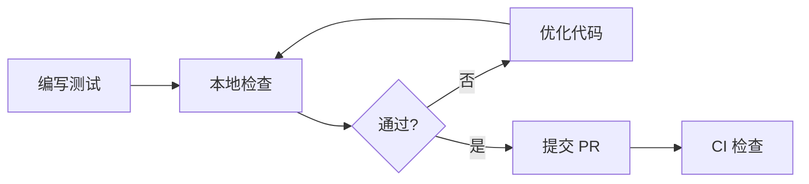

# Epic #11 质量门禁报告 (EPIC11_QUALITY_GATE_REPORT)

**版本**: 1.0
**日期**: 2026-03-02
**任务**: Task 11.4 - 建立质量门禁和规范
**状态**: ✅ 已完成

---

## 📋 执行摘要

本报告记录 Epic #11 测试代码质量重构项目的质量门禁建立过程。

### 交付物

| 交付物 | 状态 | 位置 |
|--------|------|------|
| 测试代码质量规范 | ✅ 已创建 | `docs/testing/strategy/TEST_CODE_STANDARDS.md` |
| 自动检查脚本 | ✅ 已创建 | `check_test_file_size.sh` |
| 质量门禁报告 | ✅ 本文档 | `docs/reports/testing/EPIC11_QUALITY_GATE_REPORT.md` |

### 关键指标

| 指标 | 当前值 | 目标值 | 状态 |
|------|--------|--------|------|
| 测试文件总数 | 109+ | N/A | - |
| 严重超标文件 (>600行) | 3 | 0 | 🚨 需重构 |
| 超标文件 (500-600行) | 10 | 0 | ⚠️ 需优化 |
| 警告文件 (400-500行) | 13 | <10 | ⚠️ 需关注 |
| 健康文件 (<400行) | 83 | >90% | ✅ 76.1% |

---

## 🎯 质量标准

### 文件大小限制

根据 `TEST_CODE_STANDARDS.md`，测试文件应遵循以下标准：

```
优秀 (推荐):  200-300 行
良好 (可接受): 301-400 行
警告 (需关注): 401-500 行
超标 (需优化): 501-600 行
严重 (必须重构): >600 行
```

### 不同测试类型的建议大小

| 测试类型 | 推荐行数 | 最大行数 |
|---------|---------|---------|
| Model 测试 | 150-250 | 400 |
| UseCase 测试 | 200-300 | 450 |
| ViewModel 测试 | 250-350 | 500 |
| Repository 测试 | 200-300 | 450 |
| UI Component 测试 | 200-350 | 500 |
| Integration 测试 | 300-400 | 550 |

---

## 🔧 质量检查工具

### 自动检查脚本

**脚本**: `check_test_file_size.sh`

**功能**:
- 扫描所有测试文件
- 按严重程度分类显示
- 支持 CI 模式（质量门禁）
- 支持详细输出模式

**用法**:
```bash
# 本地检查
./check_test_file_size.sh

# CI 模式（超标时返回非零退出码）
./check_test_file_size.sh --ci

# 详细输出
./check_test_file_size.sh --verbose
```

**输出示例**:
```
========================================
  Wordland 测试代码质量检查
========================================

📊 总体统计
────────────────────────────────────
  总文件数: 109
  总行数:   40,393
  平均行数: 370

📈 文件分布
────────────────────────────────────
  ✅ 优秀 (≤300行): 45
  ✓ 良好 (301-400行): 38
  ⚠️  警告 (401-500行): 13
  🚨 超标 (501-600行): 10
  🔴 严重 (>600行): 3

💚 健康度
────────────────────────────────────
  优秀 (76% 符合标准)

⚠️  需要关注的文件
────────────────────────────────────

🔴 严重问题 (>600行) - 必须重构:
  ✗ LearningViewModelTest.kt (1563 行)
  ✗ MatchGameViewModelTest.kt (1384 行)
  ✗ StarRatingCalculatorTest.kt (1382 行)
...
```

---

## 📊 当前状态分析

### 严重问题文件 (P0) - 需立即重构

| 文件 | 行数 | 超标倍数 | 建议拆分 |
|------|------|---------|---------|
| `LearningViewModelTest.kt` | 1563 | 3.9x | 6 个测试类 |
| `MatchGameViewModelTest.kt` | 1384 | 3.5x | 5-6 个测试类 |
| `StarRatingCalculatorTest.kt` | 1382 | 3.5x | 5-6 个测试类 |

### 中等问题文件 (P1) - 近期优化

**ViewModel Tests**:
- `OnboardingViewModelTest.kt` (950 行)
- `QuickJudgeViewModelTest.kt` (710 行)
- `WorldMapViewModelTest.kt` (569 行)

**UseCase Tests**:
- `SubmitAnswerUseCaseTest.kt` (887 行)
- `SubmitQuickJudgeAnswerUseCaseTest.kt` (723 行)
- `GetLevelStatisticsUseCaseTest.kt` (717 行)
- `HintSystemIntegrationTest.kt` (590 行)

**其他**:
- `FillBlankQuestionTest.kt` (881 行)
- `StarRatingIntegrationTest.kt` (683 行)
- `IslandMasteryRepositoryTest.kt` (693 行)
- `EnhancedComboEffectsTest.kt` (762 行)
- `ViewModeTransitionTest.kt` (604 行)

### 轻微问题文件 (P2) - 持续改进

13 个文件在 500-600 行之间，包括：
- UseCase 测试 (6 个)
- Domain 测试 (2 个)
- UI 测试 (1 个)
- Repository 测试 (1 个)
- ViewModel 测试 (1 个)
- UI Screen 测试 (2 个)

---

## 🚀 质量门禁流程

### 开发阶段



### Code Review 检查清单

提交测试代码前必须确认：

- [ ] 测试文件行数不超过 500 行
- [ ] 每个测试方法遵循 AAA 模式
- [ ] 测试命名清晰描述测试意图
- [ ] 没有硬编码的重复测试数据
- [ ] Mock 对象正确设置和验证
- [ ] 测试之间完全独立
- [ ] 边界条件和异常情况有测试覆盖
- [ ] 测试执行时间合理（单个测试 < 1 秒）

### CI/CD 集成

质量检查脚本已准备集成到 CI/CD：

```yaml
# .github/workflows/ci.yml (建议添加)
- name: Check Test Code Quality
  run: |
    chmod +x ./check_test_file_size.sh
    ./check_test_file_size.sh --ci
```

**退出码说明**:
- `0`: 所有文件符合标准
- `1`: 存在超标文件 (500-600行)
- `2`: 存在严重超标文件 (>600行)

---

## 📚 文档和规范

### 相关文档

| 文档 | 用途 |
|------|------|
| `TEST_CODE_STANDARDS.md` | 测试代码质量规范 |
| `TEST_CODE_QUALITY_ANALYSIS_2026-03-02.md` | 详细分析报告 |
| `UI_TESTING_GUIDE.md` | UI 测试指南 |

### 拆分规范

按功能模块拆分的命名示例：

```
原始文件: LearningViewModelTest.kt

拆分后:
├── LearningViewModelLoadLevelTest.kt
├── LearningViewModelSubmitAnswerTest.kt
├── LearningViewModelHintTest.kt
├── LearningViewModelComboTest.kt
├── LearningViewModelLevelCompletionTest.kt
└── LearningViewModelEdgeCasesTest.kt
```

### 测试结构模板

```kotlin
class MyFeatureTest {

    // ========== 测试固件 ==========
    private lateinit var subject: MyFeature

    @Before
    fun setup() { /* ... */ }

    // ========== 正常路径测试 ==========
    @Test
    fun `should do something when condition is met`() { /* ... */ }

    // ========== 异常路径测试 ==========
    @Test
    fun `should throw exception when input is invalid`() { /* ... */ }

    // ========== 边界条件测试 ==========
    @Test
    fun `should handle edge case correctly`() { /* ... */ }
}
```

---

## 🎯 后续行动

### 立即行动 (P0)

1. **重构严重超标文件** (10-14h)
   - LearningViewModelTest.kt
   - MatchGameViewModelTest.kt
   - StarRatingCalculatorTest.kt

2. **集成 CI 检查** (1-2h)
   - 更新 .github/workflows/ci.yml
   - 配置质量门禁

### 近期规划 (P1)

1. **重构中等问题文件** (22-28h)
   - 10 个 600-1000 行的文件

2. **团队培训** (2-3h)
   - 测试代码规范培训
   - 拆分最佳实践分享

### 长期优化 (P2)

1. **重构轻微问题文件** (15-22h)
   - 13 个 500-600 行的文件

2. **持续质量监控**
   - 定期运行检查脚本
   - Code Review 严格执行

---

## 📈 成功指标

### 短期目标 (P0 完成)

- [ ] 所有 P0 文件降至 500 行以下
- [ ] 测试覆盖率保持不变
- [ ] 所有测试通过

### 中期目标 (P1 完成)

- [ ] 所有 P1 文件降至 500 行以下
- [ ] 健康文件比例 >85%
- [ ] CI/CD 质量门禁上线

### 长期目标 (P2 完成)

- [ ] 所有文件控制在 400 行以内
- [ ] 平均测试文件大小 <300 行
- [ ] 建立持续质量监控机制

---

## 📝 版本历史

| 版本 | 日期 | 变更内容 |
|------|------|---------|
| 1.0 | 2026-03-02 | 初始版本，建立质量门禁和规范 |

---

## 👥 责任人

| 角色 | 责任 |
|------|------|
| **android-architect** | 制定规范，设计质量门禁 |
| **android-test-engineer** | 执行检查，维护脚本 |
| **android-engineer** | 实施重构，遵循规范 |

---

**报告生成**: 2026-03-02
**下次审核**: P0 重构完成后
**维护者**: android-architect
